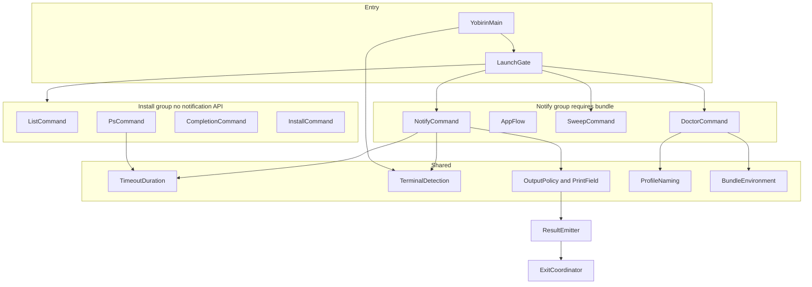
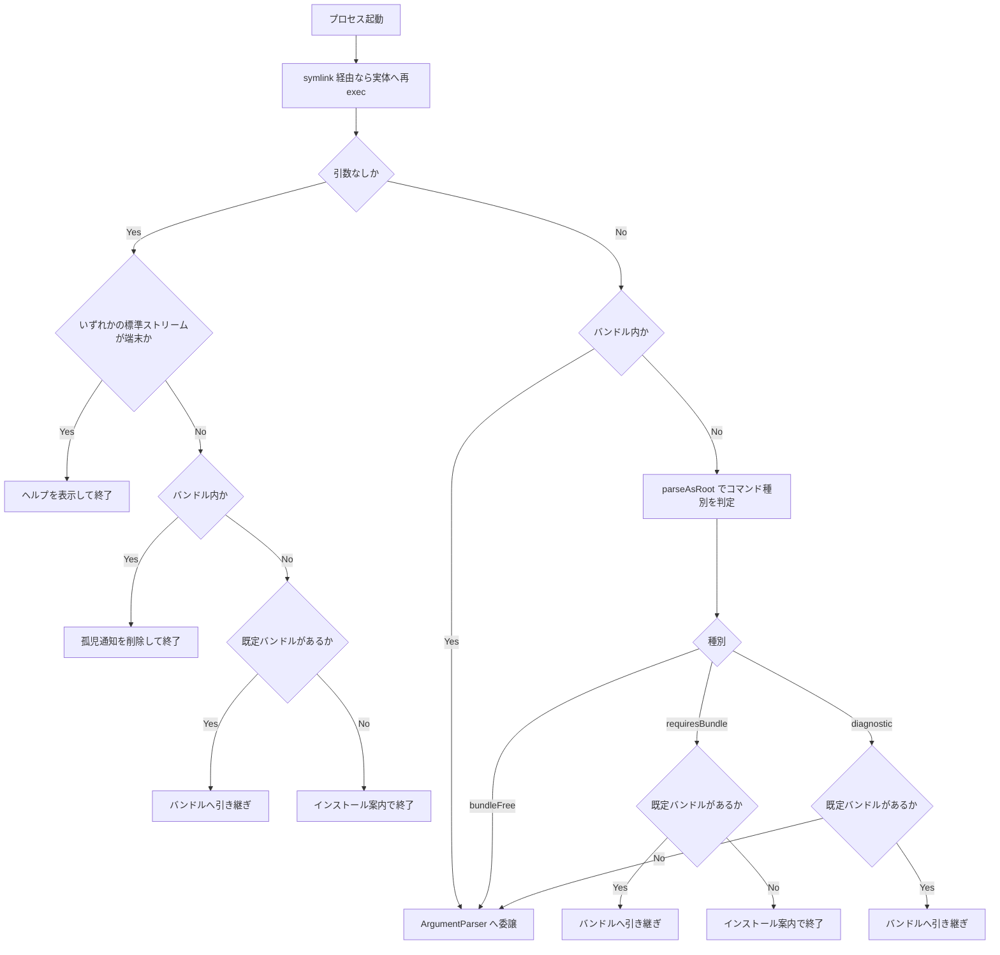
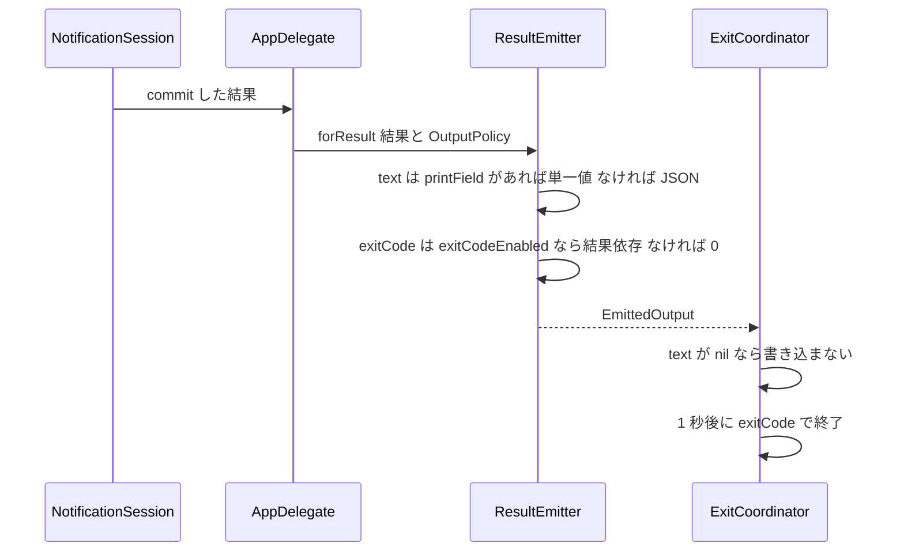

# Technical Design Document: cli-arguments-ux

## Overview

**Purpose**: 本機能は、yobirin をシェルスクリプトおよび coding agent の hook から扱う開発者に対し、`jq` に依存しない結果取得手段、引数の誤りが即座に分かるエラー体験、詰まったときの自己診断手段を提供する。

**Users**: 通知の反応で処理を分岐する開発者が `--exit-code` / `--print` を、hook を組む開発者が短縮フラグと単位付きタイムアウトを、通知が出ない状況に遭遇した利用者が `doctor` を利用する。

**Impact**: 既存の「結果JSON + exit 0」という既定の振る舞いは変更しない。変更の中心は、(a) 出力方針を CLI から `ResultEmitter` まで運ぶ経路の新設、(b) 起動ゲートの判定基盤を引数の位置走査からコマンド解決の結果へ置き換えること、(c) サブコマンドの追加 (`completion` / `sweep` / `doctor`) の3点である。

### Goals

- `notify` の結果を、`jq` を介さずに終了コードと単一フィールドの生値として取得できるようにする (1, 2, 3)
- 引数の解釈をパーサに一元化し、バンドル外実行時のクラッシュ経路を閉じる (11)
- 短縮フラグと単位付きタイムアウトの導入によって既存機能 (`ps`・プロファイルディスパッチ) を壊さない (6.6, 14)
- ヘルプ・補完・診断により、README を開かずに問題を切り分けられるようにする (7, 8, 15)

### Non-Goals

- 待機中プロセスの停止手段。`ps --json` と `kill` の組み合わせで実現でき、プロセス管理は本CLIの責務ではない
- 結果JSONのスキーマ変更。既存の消費者との互換を保つ
- `--image` のファイルサイズ上限の検証。形式と存在のみを検証し、上限超過は従来の環境エラー経路に残す
- インストーラ本体 (バンドル組み立て・署名・配置・LaunchServices 登録) の変更

## Boundary Commitments

### This Spec Owns

- `notify` の引数受理範囲と、結果の出力表現 (JSON / 単一フィールド) および終了コードの決定規則
- 起動ゲートのコマンド種別判定と、その判定に基づく実行の引き継ぎ・案内・ヘルプ表示の分岐
- 新規サブコマンド `completion` / `sweep` / `doctor` の契約
- `ps` の argv 解釈規則と絞り込み
- タイムアウト文字列 → 秒数の変換規則 (`notify` と `ps` が共有する唯一の定義)
- 端末接続の判定 (`isatty`) を用いる箇所の注入点
- 上記に伴う README の追随更新

### Out of Boundary

- `Installer` の処理順・署名・配置・確認通知 (Requirement 20 系) の振る舞い
- `NotificationSession` の応答判別・排他確定・group 置換の規則
- `ProfileNaming` の命名規約 (バンドル名・Bundle ID・パス導出)
- 結果JSONのキー構成
- `structure.md` の更新 (本specは `doctor` を通知系として分類する判断を行うが、steering への反映は別作業)

### Allowed Dependencies

- `swift-argument-parser` 1.8.2 の公開API (`parseAsRoot`, `completionScript(for:)`, `CompletionShell`, `NameSpecification`)
- 既存の `ProfileNaming` / `BundleEnvironment` / `Installer.binDirectoryEnvironmentKey` (読み取りのみ)
- `UserNotifications` は通知系コンポーネント (`NotifyCommand` / `AppFlow` / `SweepCommand` / `DoctorCommand`) からのみ
- `Darwin.isatty` は `TerminalDetection` からのみ呼ぶ。他のコンポーネントは述語を注入で受ける

**依存の禁止事項**: `install` / `uninstall` / `list` / `ps` / `completion` は `UserNotifications` および `AppKit` を import しない。この規律はレビューで import 文を機械確認する (`structure.md`)。

### Revalidation Triggers

- `EmittedOutput.text` の型変更 (`String` → `String?`) — `ExitCoordinator` の書き込み契約が変わる
- `LaunchGate.Decision` への case 追加 — `YobirinMain.main()` の分岐が網羅性を失う
- 短縮オプションへの `allowingJoined: true` の導入 — `ProfileDispatch.buildExecArguments` の除去網羅性が崩れ、exec 無限ループが再発する
- `YobirinCommand.subcommands` への追加 — 新サブコマンドがバンドルを必要とするかを `CommandKind` の分類に反映する必要がある
- タイムアウト変換規則の変更 — `notify` と `ps` の双方の表示・挙動が同時に変わる

## Architecture

### Existing Architecture Analysis

単一モジュールのフラット構成で、責務ごとの1ファイルと import 規律によって境界を表現している。最重要の境界は「通知系 (バンドル必須)」と「インストール系 (バンドル不要)」の2群。

本設計が尊重する既存の制約:

- **多段exec構成**: PATH上のsymlink → バンドル外 Mach-O → 既定バンドル → プロファイルバンドル、の最大4ホップ。`validate()` は中間ホップでも実行され、`makeNotificationRequest()` は最終ホップでのみ実行される (research.md 1.3)
- **終了コードの単一ソース**: `ResultEmitter` の定数を参照し、magic number を書かない
- **注入パターン**: 副作用は `perform(...)` 静的関数へ分離し、fake 注入でテストする
- **遅延exit**: 結果出力後 1 秒の遅延を置く。`ExitCoordinator` が担う

本設計が解消する技術的負債: argv を型を通さず走査している3箇所 (`LaunchGate` / `ProfileDispatch` / `PsCommand`) のうち、`LaunchGate` をパーサ基盤へ置き換え、残る2箇所は走査対象を短縮形・単位付き表記まで拡張する。

### Architecture Pattern & Boundary Map



**Architecture Integration**:

- **Selected pattern**: 既存のフラット構成を維持し、共有部品層 (`Shared`) を明示する。新しい階層は導入しない
- **Domain boundaries**: `Shared` は Foundation のみに依存する純粋部品。`InstallGroup` は通知APIに触れない。`NotifyGroup` のみ `UserNotifications` / `AppKit` を import する。`Entry` は両群を結線する唯一の場所
- **Existing patterns preserved**: 注入可能な `perform(...)`、純粋関数としての判定ロジック、`ResultEmitter` による終了コードの一元管理
- **New components rationale**: `TimeoutDuration` と `TerminalDetection` は複数要件が同一規則を要求するため共有化する (research.md DD-4, DD-5)。`CompletionCommand` / `SweepCommand` / `DoctorCommand` はそれぞれ独立した責務を持つ
- **Steering compliance**: `doctor` のみ import 規律の明示的な例外として扱う (research.md DD-3)。それ以外の分類は既存どおり

**Dependency direction**: `Shared` → `InstallGroup` / `NotifyGroup` → `Entry`。共有部品はコマンドを知らない。コマンド同士は依存しない。`Entry` のみが両群を参照する。

### Technology Stack

| Layer        | Choice / Version              | Role in Feature                                             | Notes                                           |
| ------------ | ----------------------------- | ----------------------------------------------------------- | ----------------------------------------------- |
| CLI          | swift-argument-parser 1.8.2   | 引数定義、コマンド解決 (`parseAsRoot`)、補完スクリプト生成  | 既存依存。宣言は `from: "1.3.0"` のまま変更不要 |
| Notification | UserNotifications (macOS 13+) | 通知許可の状態取得 (`doctor`)、配信済み通知の削除 (`sweep`) | 既存依存                                        |
| Runtime      | Darwin (`isatty`)             | 端末接続の判定                                              | 新規に使用するシステムコール                    |

新規の外部依存はない。`CompletionShell` は `ExpressibleByArgument` に適合していないため、本リポジトリ側で適合を宣言する (research.md R-3)。

## File Structure Plan

### 新規ファイル

```
Sources/yobirin/
├── TimeoutDuration.swift      # タイムアウト文字列 → 秒数の変換 (純粋関数、Foundation のみ)
├── TerminalDetection.swift    # ファイルディスクリプタの端末接続判定 (isatty の唯一の呼び出し元)
├── CompletionCommand.swift    # completion サブコマンド + CompletionShell の ExpressibleByArgument 適合
├── SweepCommand.swift         # sweep サブコマンド (孤児通知の明示的な削除)
└── DoctorCommand.swift        # doctor サブコマンド (診断項目の収集・判定・整形)
```

`OutputPolicy` / `PrintField` は新規ファイルを作らず `Output.swift` へ同居させる。出力契約の一部であり、`ResultOutput` / `ResultEmitter` と密結合なため (`structure.md`「密結合な型の同居は許容」)。

`--image` の検証と標準入力の読み取りは `NotifyCommand.swift` 内の静的関数として実装する。いずれも `notify` の入力検証・入力取得という同一の責務に属する。

### 変更ファイル

| ファイル                                         | 変更内容                                                                                                                                                                        | 要件                         |
| ------------------------------------------------ | ------------------------------------------------------------------------------------------------------------------------------------------------------------------------------- | ---------------------------- |
| `Sources/yobirin/Yobirin.swift`                  | `CommandKind` の追加、`LaunchGate.classify` / `decide` の再設計、`Decision.showHelp` の追加、`BundleVersionCheck` の表示条件、`YobirinCommand` の `abstract` とサブコマンド登録 | 7.1, 8.4, 11, 12.1, 12.2, 13 |
| `Sources/yobirin/NotifyCommand.swift`            | `--exit-code` / `--print` の追加、短縮フラグ、`--timeout` の変換委譲、`--message -` の読み取り、`--image` の事前検証、`abstract` と `discussion`                                | 1〜7, 9                      |
| `Sources/yobirin/Output.swift`                   | `PrintField` / `OutputPolicy` の追加、`ResultOutput.value(for:)`、`ResultEmitter.forResult(_:policy:)`、`ResultEmitter.exitCode(for:)`、`EmittedOutput.text` の `String?` 化    | 1, 2, 3                      |
| `Sources/yobirin/ExitCoordinator.swift`          | `text` が `nil` のとき書き込みを行わない                                                                                                                                        | 2.4                          |
| `Sources/yobirin/AppDelegate.swift`              | `OutputPolicy` を受け取り `onResult` へ反映                                                                                                                                     | 1, 2, 3                      |
| `Sources/yobirin/AppFlow.swift`                  | 未許可メッセージにバンドル名とシステム設定への案内を含める                                                                                                                      | 10                           |
| `Sources/yobirin/BundleEnvironment.swift`        | 実行中バンドルの表示名を返すヘルパの追加                                                                                                                                        | 10.1, 10.3                   |
| `Sources/yobirin/ProfileDispatch.swift`          | `buildExecArguments` の除去対象に短縮形を追加                                                                                                                                   | 6.6                          |
| `Sources/yobirin/PsCommand.swift`                | argv 解釈の短縮形対応、タイムアウト変換の委譲、`--profile` フィルタ、`TIMEOUT` 列の整形                                                                                         | 14                           |
| `Sources/yobirin/LaunchGuard.swift`              | 削除件数を呼び出し元へ返す形へ分離                                                                                                                                              | 12.5                         |
| `Sources/yobirin/NotificationCenterClient.swift` | 通知許可の状態を**読み取る**メソッドの追加 (`doctor` 用)。既存の `requestAuthorization` は許可ダイアログを出すため診断には使えない                                              | 15.4                         |
| `README.md` / `README.ja.md`                     | 終了コード表、`--print`、補完の設定手順、`sweep` による復旧手順、`doctor`                                                                                                       | 8.7, 12.6                    |

## System Flows

### 起動ゲートの判定



**Key decisions**:

- 種別判定を `parseAsRoot` の結果で行うことで、オプションの値がサブコマンド名と一致しても誤認しない (11.1, 11.2)。パース失敗は `bundleFree` に落ち、引数エラーがバンドルへ引き継がれずその場で表示される (11.5)
- `diagnostic` のみ、バンドル未インストール時に案内ではなく `runCLI` へ進む。`doctor` がインストール状態そのものを診断できるようにするため (15.5)
- `parseAsRoot` は `NSApplication` / `UserNotifications` に触れず、`run()` も呼ばない。バンドル外で安全に実行できる (11.4)

### 結果の出力と終了コードの決定



**Key decisions**: 出力表現と終了コードはいずれも `ResultEmitter` が単独で決める。`OutputPolicy` を運ぶ経路を1本足すだけで、`ExitCoordinator` の遅延exit機構と `NotificationSession` の一度きり確定機構には触れない。

## Requirements Traceability

| Requirement | Summary                    | Components                                               | Interfaces                               | Flows      |
| ----------- | -------------------------- | -------------------------------------------------------- | ---------------------------------------- | ---------- |
| 1.1〜1.8    | 結果に応じた終了コード     | ResultEmitter, OutputPolicy, AppDelegate, NotifyCommand  | `exitCode(for:)`, `forResult(_:policy:)` | 結果の出力 |
| 2.1〜2.7    | 単一フィールドの直接出力   | ResultOutput, ResultEmitter, ExitCoordinator             | `value(for:)`, `PrintField`              | 結果の出力 |
| 3.1, 3.2    | 併用                       | ResultEmitter                                            | `forResult(_:policy:)`                   | 結果の出力 |
| 4.1〜4.6    | 単位付きタイムアウト       | TimeoutDuration, NotifyCommand                           | `seconds(from:)`                         | -          |
| 5.1〜5.5    | 標準入力からの本文         | NotifyCommand, TerminalDetection                         | `resolvedMessage(...)`                   | -          |
| 6.1〜6.5    | 短縮フラグ                 | NotifyCommand                                            | `@Option(name:)`                         | -          |
| 6.6         | 再ディスパッチ防止         | ProfileDispatch                                          | `buildExecArguments`                     | -          |
| 7.1〜7.4    | ヘルプ                     | YobirinCommand, NotifyCommand, 各サブコマンド            | `CommandConfiguration`                   | -          |
| 8.1〜8.8    | 補完スクリプト             | CompletionCommand, LaunchGate                            | `completionScript(for:)`                 | 起動ゲート |
| 9.1〜9.5    | 画像の事前検証             | NotifyCommand                                            | `validate()`                             | -          |
| 10.1〜10.5  | 未許可時の案内             | AppFlow, BundleEnvironment                               | `currentBundleDisplayName()`             | -          |
| 11.1〜11.6  | コマンド種別判定           | LaunchGate, CommandKind                                  | `classify(...)`, `decide(...)`           | 起動ゲート |
| 12.1〜12.6  | 引数なし実行と明示的な掃除 | LaunchGate, SweepCommand, LaunchGuard, TerminalDetection | `decide(...)`, `sweep(...)`              | 起動ゲート |
| 13.1〜13.4  | バージョン案内の表示条件   | BundleVersionCheck, BundleHandoff, TerminalDetection     | `updateNotice(...)`                      | 起動ゲート |
| 14.1〜14.9  | ps の解釈と絞り込み        | PsCommand, TimeoutDuration                               | `perform(...)`                           | -          |
| 15.1〜15.9  | 環境診断                   | DoctorCommand, ProfileNaming, BundleEnvironment          | `perform(...)`                           | 起動ゲート |

## Components and Interfaces

| Component                 | Domain/Layer | Intent                                       | Req Coverage        | Key Dependencies (P0/P1)                     | Contracts |
| ------------------------- | ------------ | -------------------------------------------- | ------------------- | -------------------------------------------- | --------- |
| TimeoutDuration           | Shared       | タイムアウト文字列を秒数へ換算する唯一の規則 | 4, 14.3, 14.4       | Foundation (P0)                              | Service   |
| TerminalDetection         | Shared       | ファイルディスクリプタの端末接続判定         | 5.3, 12.1, 13.1     | Darwin isatty (P0)                           | Service   |
| OutputPolicy / PrintField | Shared       | 出力表現と終了コードの方針                   | 1, 2, 3             | -                                            | State     |
| ResultEmitter             | Output       | 出力表現と終了コードの決定                   | 1, 2, 3             | OutputPolicy (P0)                            | Service   |
| LaunchGate / CommandKind  | Entry        | コマンド種別の判定と起動の分岐               | 11, 12.1, 12.2, 8.4 | ArgumentParser (P0)                          | Service   |
| NotifyCommand             | Notify       | 引数定義・入力検証・入力取得                 | 1〜7, 9             | TimeoutDuration (P0), TerminalDetection (P1) | CLI       |
| AppFlow                   | Notify       | 認可・配信・未許可時の案内                   | 10                  | BundleEnvironment (P1)                       | -         |
| CompletionCommand         | Install      | 補完スクリプトの出力                         | 8                   | ArgumentParser (P0)                          | CLI       |
| SweepCommand              | Notify       | 孤児通知の明示的な削除と件数報告             | 12.3〜12.5          | UserNotifications (P0)                       | CLI       |
| DoctorCommand             | Notify       | 環境診断の収集・判定・整形                   | 15                  | ProfileNaming (P0), UserNotifications (P1)   | CLI, API  |
| PsCommand                 | Install      | argv 解釈の追随と絞り込み                    | 14                  | TimeoutDuration (P0)                         | CLI, API  |

### Shared

#### TimeoutDuration

| Field        | Detail                                           |
| ------------ | ------------------------------------------------ |
| Intent       | タイムアウト指定文字列を秒数へ換算する唯一の規則 |
| Requirements | 4.1, 4.2, 4.3, 4.4, 4.5, 14.3, 14.4              |

**Responsibilities & Constraints**

- 単位なしの数値は秒として解釈する (既存互換。小数を許容する)
- `h` / `m` / `s` を伴う指定、およびそれらの連結を解釈する
- 解釈できない入力と、換算結果が正でない入力を区別せず `nil` を返す。文言の生成は呼び出し側が行う
- Foundation のみに依存する。通知APIに触れない (14.9 の前提)

**Dependencies**: Outbound: なし / External: Foundation (P0)

**Contracts**: Service [x]

##### Service Interface

```swift
enum TimeoutDuration {
    /// 受理する文法:
    ///   bare   := <正の10進数、小数可>            例: "300", "0.5"
    ///   united := (<正の整数><h|m|s>)+            例: "5m", "90s", "1h30m"
    /// いずれにも一致しない、または換算結果が 0 以下なら nil。
    static func seconds(from value: String) -> Double?
}
```

- Preconditions: なし
- Postconditions: 戻り値が非nilのとき、その値は正の秒数
- Invariants: 同一入力に対して常に同一の結果を返す (純粋関数)

**Implementation Notes**

- Integration: `NotifyCommand` は `@Option(transform:)` から、`PsCommand` は argv から抽出した文字列に対して呼ぶ
- Validation: 単位の重複 (`5m5m`) と順序 (`30m1h`) を許容するかを決める。**許容する** — 合計値が定まるため拒否する理由がなく、拒否規則を足すと説明対象が増える
- Risks: 既存の `parseTimeout` は `Double(value)` のみを見ていた。`"5"` のような入力の解釈は変わらない

#### TerminalDetection

| Field        | Detail                                               |
| ------------ | ---------------------------------------------------- |
| Intent       | ファイルディスクリプタが端末に接続されているかの判定 |
| Requirements | 5.3, 12.1, 12.2, 13.1, 13.2                          |

**Responsibilities & Constraints**

- `isatty` を呼ぶ唯一の場所。他のコンポーネントは判定結果または述語を注入で受ける
- 判定対象は要件ごとに異なるため単一の真偽値へは畳まない (research.md DD-5)

**Contracts**: Service [x]

##### Service Interface

```swift
enum TerminalDetection {
    typealias Predicate = (Int32) -> Bool

    /// 実システムへの問い合わせ。`isatty` の呼び出しはここに限る。
    static func defaultPredicate(_ descriptor: Int32) -> Bool

    /// 標準入力・標準出力・標準エラーのいずれかが端末か (12.1, 12.2)
    static func isAnyStandardStreamTerminal(_ predicate: Predicate = defaultPredicate) -> Bool
}
```

`Predicate` に `@Sendable` を付けず、既定実装を `static let` ではなく `static func` で提供する。
Swift 6 の厳格な並行性チェックは、非Sendableなクロージャを静的な格納プロパティに保持することを
コンパイルエラーとして拒否する (2026-07-30 実測)。一方 `Predicate` を `@Sendable` にすると、
テストが可変ローカル変数を捕捉して呼び出しを記録できなくなる。既存の
`ExitCoordinator.defaultWriter` / `ProfileDispatch.defaultExec` と同じ形に揃える。

- Postconditions: 副作用を持たない
- Invariants: `live` 以外の経路で `isatty` を呼ばない

#### OutputPolicy / PrintField

| Field        | Detail                               |
| ------------ | ------------------------------------ |
| Intent       | 結果の出力表現と終了コードの決定方針 |
| Requirements | 1.1〜1.8, 2.1〜2.7, 3.1, 3.2         |

**Contracts**: State [x]

##### State Management

```swift
enum PrintField: String, CaseIterable, ExpressibleByArgument {
    case result
    case action
    case actionIndex
    case text
}

struct OutputPolicy: Equatable {
    var exitCodeEnabled: Bool
    var printField: PrintField?

    /// 既存の振る舞い: 結果JSON全体を出力し、常に exit 0 (1.5, 2.6)
    static let `default` = OutputPolicy(exitCodeEnabled: false, printField: nil)
}
```

- State model: 不変値。`NotifyCommand` が構築し、`AppDelegate` を経て `ResultEmitter` まで読み取り専用で渡る
- Concurrency: 値型かつ不変のため共有に制約はない

`PrintField` を `String` の RawValue を持つ列挙型とすることで、`ExpressibleByArgument` の既定実装が 2.2 (4種類への限定) と 2.3 (それ以外の拒否) を同時に満たす。追加の検証コードを書かない。

### Output

#### ResultEmitter / ResultOutput

| Field        | Detail                                   |
| ------------ | ---------------------------------------- |
| Intent       | 結果値から出力表現と終了コードを決定する |
| Requirements | 1.1〜1.8, 2.1〜2.7, 3.1, 3.2             |

**Responsibilities & Constraints**

- 終了コードの数値はすべてこの型の定数として定義する。他の場所に magic number を書かない (`structure.md`)
- `--print` 指定時に該当フィールドが存在しない場合、`text` は `nil` となり書き込み自体が行われない (2.4)
- 既存の予約コード (未許可 2 / 環境エラー 1) は `--exit-code` の有無に関わらず変更しない (1.6, 1.7)

**Dependencies**: Inbound: AppDelegate (P0) / Outbound: ExitCoordinator (P0)

**Contracts**: Service [x] / API [x]

##### Service Interface

```swift
struct EmittedOutput: Equatable {
    let destination: OutputDestination
    /// nil は「出力しない」を意味する (2.4)。空文字列は「空行を出力する」とは区別される。
    let text: String?
    let exitCode: Int32
}

extension ResultOutput {
    /// 指定フィールドの生の値。結果種別に存在しないフィールドは nil (2.4)。
    /// JSON のクォート・エスケープを施さない (2.5)。
    func value(for field: PrintField) -> String?
}

enum ResultEmitter {
    static let permissionDeniedExitCode: Int32 = 2   // 既存
    static let environmentErrorExitCode: Int32 = 1   // 既存
    static let dismissedExitCode: Int32 = 3
    static let timeoutExitCode: Int32 = 4
    static let actionExitCodeBase: Int32 = 10

    /// 1.1〜1.4 の対応表。--exit-code 未指定時は呼ばれない。
    static func exitCode(for result: NotificationResult) -> Int32

    /// policy 省略時は既存の振る舞い (JSON 全体 + exit 0) を保つ。
    static func forResult(_ output: ResultOutput, policy: OutputPolicy = .default) -> EmittedOutput
}
```

- Preconditions: `forResult` は結果が確定した後にのみ呼ばれる
- Postconditions: `policy == .default` のとき、戻り値は変更前の実装と完全に一致する
- Invariants: `exitCode` が 1 または 2 を返すことはない (予約コードとの衝突禁止)

##### API Contract (`--print` の出力)

| PrintField    | 出現条件            | 出力例                                                     |
| ------------- | ------------------- | ---------------------------------------------------------- |
| `result`      | 常に                | `clicked` / `action` / `replied` / `dismissed` / `timeout` |
| `action`      | `result == action`  | `Approve`                                                  |
| `actionIndex` | `result == action`  | `0`                                                        |
| `text`        | `result == replied` | 入力された文字列そのまま                                   |

出現条件を満たさない組み合わせは出力なし (2.4)。

**Implementation Notes**

- Integration: `forResult` に既定引数を与えるため、既存の呼び出し3箇所 (`AppDelegate.swift:29`, `AppFlowTests.swift:175`, `IntegrationFlowTests.swift:143`) は無改修で通る
- Validation: `policy == .default` での出力が既存と一致することを回帰テストで固定する
- Risks: `EmittedOutput.text` の `String?` 化は `ExitCoordinator.finish` と `OutputTests` に波及する。書き込み契約の変更にあたるため Revalidation Trigger に記載済み

### Entry

#### LaunchGate / CommandKind

| Field        | Detail                                           |
| ------------ | ------------------------------------------------ |
| Intent       | 引数からコマンド種別を判定し、起動の分岐を決める |
| Requirements | 8.4, 8.6, 11.1〜11.6, 12.1, 12.2                 |

**Responsibilities & Constraints**

- 種別判定はコマンド解決の結果に基づく。引数文字列の位置走査を行わない (11.1)
- 判定は通知APIに触れる前に完了する。`parseAsRoot` はコマンドのインスタンスを生成するのみで `run()` を呼ばない (11.4)
- **`parseAsRoot` はパースの一環として `validate()` を実行する** (2026-07-30 実測)。したがって起動ゲートでの分類時にも `validate()` が走り、バンドル外のホップを含めて最大3回実行される。`NotifyCommand.validate()` に副作用を置けない理由はこの事実に由来する
- `--help` / `-h` は throw せず `HelpCommand` のインスタンスが返る (実測)。分類は throw の有無ではなく**返ってきた型**で行うため、`HelpCommand` は `bundleFree` に落ちる。`--version` / `--generate-completion-script` / 引数エラーは throw する
- 分岐の決定は純粋関数として切り出し、パースと副作用から分離する

**Dependencies**: Outbound: YobirinCommand (P0) / External: ArgumentParser (P0)

**Contracts**: Service [x]

##### Service Interface

```swift
enum CommandKind: Equatable {
    /// 通知APIを必要とする (NotifyCommand, SweepCommand)
    case requiresBundle
    /// バンドルが望ましいが、無くても劣化して完走する (DoctorCommand)
    case diagnostic
    /// 通知APIに触れない。ヘルプ・バージョン・補完・引数エラーを含む
    case bundleFree
}

extension LaunchGate {
    /// 分類は「返ってきたコマンドの型」で行う。throw した場合も bundleFree として扱う (11.5, 8.6)。
    /// parse を注入してテストする。
    static func classify(
        arguments: [String],
        parse: ([String]) throws -> ParsableCommand
    ) -> CommandKind

    static func decide(
        arguments: [String],
        kind: CommandKind,
        isOutsideBundle: Bool,
        isDefaultBundleInstalled: Bool,
        isInteractive: Bool
    ) -> Decision
}

extension LaunchGate.Decision {
    case showHelp          // 新規 (12.1)
    // 既存: sweepOrphans / runCLI / guideInstall / execInstalledBundle
}
```

- Preconditions: `classify` に渡す引数列は `CommandLine.arguments` から実行ファイル名を除いたもの
- Postconditions: `decide` は副作用を持たない
- Invariants: `kind == .bundleFree` のとき、`decide` は `.execInstalledBundle` および `.guideInstall` を返さない

**Implementation Notes**

- Integration: `YobirinMain.main()` は `classify` → `decide` の順に呼び、`Decision` で分岐する。`.showHelp` は `YobirinCommand` のヘルプ文字列を stdout へ書いて exit 0
- Validation: 既存の `LaunchGateTests` は `decide` の純粋性に依存しており、引数追加に伴う更新のみで済む。`classify` は fake の `parse` で網羅する
- Risks: `subcommands` へ追加したコマンドを `classify` の分類へ反映し忘れると、バンドル必須のコマンドがバンドル外で走る。分類は「`NotifyCommand` / `SweepCommand` なら `requiresBundle`、`DoctorCommand` なら `diagnostic`、それ以外は `bundleFree`」という型による判定とし、網羅性をテストで固定する

#### BundleVersionCheck / BundleHandoff

| Field        | Detail                                     |
| ------------ | ------------------------------------------ |
| Intent       | 引き継ぎ先バンドルとのバージョン比較と案内 |
| Requirements | 13.1, 13.2, 13.3, 13.4                     |

**Responsibilities & Constraints**

- 案内の生成は純粋関数のまま維持し、表示するかどうかの判定を呼び出し側へ移す
- 案内の有無は処理の成否・終了コードに影響しない (13.3)。stdout を汚さない (13.4。既存の Requirement 17.4 を継承)

**Implementation Notes**

- Integration: `BundleHandoff.execDefaultBundle` に端末判定の述語を注入し、`isInteractive` が偽なら `stderrWriter` を呼ばない
- Risks: 案内が出なくなることで、バージョン不一致に気付く機会が減る。`doctor` が同じ不一致を報告するため (15.2)、発見手段は失われない

### Notify

#### NotifyCommand

| Field        | Detail                                 |
| ------------ | -------------------------------------- |
| Intent       | 通知送信の引数定義・入力検証・入力取得 |
| Requirements | 1〜7, 9                                |

**Responsibilities & Constraints**

- **標準入力の読み取りは `makeNotificationRequest()` で行う。`validate()` では行わない。** `validate()` は起動ゲートの分類時 (`parseAsRoot` が実行する) と中間ホップの両方で走り、最終ホップまでに最大3回実行される。そこで stdin を読むと `--profile` 併用時に最終ホップの標準入力が空になる (research.md F4, 要件 5.5)
- **`validate()` に置いてよいのは、何度実行しても結果と外部状態が変わらない検証だけである。** ファイルの読み書き・ロック取得・ストリームの消費を置いてはならない。この制約は上記の複数回実行に由来する
- `validate()` で行う検証は副作用を持たないものに限る。`--image` の存在確認と拡張子判定、`--reply-placeholder` の依存関係、`--message -` 指定時の端末判定 (読み取りは伴わない)
- `--image` の検証は通知許可の要求より前に完了する (9.1)

**Dependencies**: Outbound: TimeoutDuration (P0), TerminalDetection (P1), OutputPolicy (P0), ProfileDispatch (P0)

**Contracts**: CLI [x]

##### CLI Contract (追加・変更分)

| Option            | 短縮形 | 変更                                | 要件     |
| ----------------- | ------ | ----------------------------------- | -------- |
| `--title`         | `-t`   | 短縮形の追加                        | 6.1      |
| `--message`       | `-m`   | 短縮形の追加、`-` で標準入力        | 5, 6.1   |
| `--profile`       | `-p`   | 短縮形の追加                        | 6.1      |
| `--action`        | `-a`   | 短縮形の追加 (繰り返し可)           | 6.1, 6.3 |
| `--timeout`       | なし   | 単位付き指定の受理                  | 4        |
| `--exit-code`     | なし   | 新規 (Flag)                         | 1        |
| `--print <field>` | なし   | 新規 (Option)。短縮形を割り当てない | 2, 6.4   |
| `--image`         | なし   | 事前検証の追加                      | 9        |

`-p` は `--profile` に予約する。`--print` に短縮形を与えない理由は、`-p` の意味が揺れることを避けるためである (6.4)。

**Implementation Notes**

- Integration: `--image` の対応拡張子は `png` / `jpg` / `jpeg` / `gif` の4種 (research.md R-1)。判定は小文字化した拡張子の一致で行う
- Validation: `--timeout` は `@Option(transform:)` から `TimeoutDuration.seconds(from:)` を呼び、`nil` なら `ValidationError` を投げる。エラー文言は受理する書式を含める
- Risks: 短縮形の追加は `allowingJoined` を有効化しない前提でのみ安全。有効化すると `ProfileDispatch` の除去が不完全になる (Revalidation Trigger)

#### AppFlow

| Field        | Detail                                                       |
| ------------ | ------------------------------------------------------------ |
| Intent       | 認可・配信・タイマーのオーケストレーションと、未許可時の案内 |
| Requirements | 10.1〜10.5                                                   |

**Implementation Notes**

- Integration: 表示名は `BundleEnvironment.currentBundleDisplayName()` から取得する。`--profile` 指定時は既にプロファイルのバンドル内で実行されているため、この経路で自動的に正しい名前が得られる (10.3)
- Validation: 文言は `Notifications are not permitted for "<name>". Enable them in System Settings > Notifications > <name>.` の形とし、テストで名前の埋め込みを検証する
- Risks: 表示名が取得できない場合 (理論上バンドル内では起きない) はバンドル名部分を省いた従来文言へ退避する

#### SweepCommand

| Field        | Detail                                             |
| ------------ | -------------------------------------------------- |
| Intent       | 配信済みの孤児通知を明示的に削除し、件数を報告する |
| Requirements | 12.3, 12.4, 12.5                                   |

**Responsibilities & Constraints**

- 標準ストリームの接続状態によらず削除する (12.4)。引数なし実行の分岐とは独立
- 削除対象は自バンドルが配信した通知に限られる (`getDeliveredNotifications` の性質。既存の `LaunchGuard` と同じ)

**Dependencies**: Outbound: LaunchGuard (P0) / External: UserNotifications (P0)

**Contracts**: CLI [x]

**Implementation Notes**

- Integration: `LaunchGuard` から「削除して件数を返す」処理を分離し、引数なし経路と `sweep` 経路が同じ実装を共有する。引数なし経路は件数を捨てる
- Validation: 出力は `Removed N delivered notification(s)` の形。0件でも同じ形式で報告する
- Risks: 本サブコマンドは当初のUX改善リストに無い追加である。Req 12.1 が README 記載の復旧手順を無効化するため、代替として必須と判断した (research.md DD-2)

#### DoctorCommand

| Field        | Detail                                                       |
| ------------ | ------------------------------------------------------------ |
| Intent       | インストール状態・バージョン整合・リンク・通知許可を診断する |
| Requirements | 15.1〜15.9                                                   |

**Responsibilities & Constraints**

- バンドル外で実行され得る (15.5)。通知APIの**呼び出し**はバンドル内であることを実行時に確認してから行う。import しているだけでは例外は発生しない
- 既存の import 規律に対する明示的な例外。`install` / `uninstall` / `list` / `ps` / `completion` は従来どおり通知APIに触れない (research.md DD-3)
- 診断項目の収集・判定・整形を注入可能な `perform(...)` に集約する (`ListCommand` / `PsCommand` と同じ方針)

**Dependencies**: Outbound: ProfileNaming (P0), BundleEnvironment (P0), Installer.binDirectoryEnvironmentKey (P1) / External: UserNotifications (P1)

**Contracts**: CLI [x] / API [x]

##### Service Interface

```swift
extension DoctorCommand {
    enum Status: String {
        case ok
        case warning
        case failure
        /// 判定できなかった (バンドル外での通知許可など)。問題として数えない (15.5)
        case unknown
    }

    struct Check: Equatable {
        let name: String
        let status: Status
        let detail: String
        /// 次に取るべき操作 (15.6)。status が ok / unknown のときは nil
        let remedy: String?
    }

    static func perform(
        json: Bool,
        checks: [Check],
        stdoutWriter: (String) -> Void,
        exit: (Int32) -> Void
    )
}
```

- Postconditions: `warning` または `failure` が1件以上あれば非0で終了する (15.8)。それ以外は 0 (15.7)
- Invariants: `unknown` は終了コードに影響しない

##### API Contract (`--json`)

```json
{
  "checks": [{ "name": "bundle", "status": "ok", "detail": "...", "remedy": null }],
  "problems": 0
}
```

##### 診断項目

| name         | 判定内容                                 | failure / warning の条件                   | 要件       |
| ------------ | ---------------------------------------- | ------------------------------------------ | ---------- |
| `bundle`     | 既定バンドルの有無・パス・バージョン     | 未インストールなら failure                 | 15.1       |
| `profiles`   | プロファイルバンドルの一覧               | なし (0件でも ok)                          | 15.1       |
| `version`    | 実行中バイナリとバンドルのバージョン一致 | 不一致なら warning                         | 15.2       |
| `link`       | PATH上のリンクの有無と指し先の実在       | 不在または dangling なら warning           | 15.3       |
| `permission` | 通知許可の状態                           | 未許可なら failure。バンドル外なら unknown | 15.4, 15.5 |

**Implementation Notes**

- Integration: `link` のパス解決は `Installer.binDirectoryEnvironmentKey` と既定値 `$HOME/.local/bin` を参照する。パス組み立てを `DoctorCommand` 側で重複させない。リンクの有無は `attributesOfItem` (lstat 相当) で見る。既存 `Installer` と同じ理由で、壊れたリンクを「存在しない」と誤判定しないため
- Validation: `perform` へ `Check` の配列を注入する形にし、収集処理と整形処理を別々にテストする
- Integration: **`doctor` は `requestAuthorization` を呼んではならない。** 現在の `NotificationCenterClient` には許可状態を読むメソッドが無く、既存の抽象をそのまま使うと診断のたびに許可を要求することになる (未許可の初回は許可ダイアログが出る)。プロトコルへ `getNotificationSettings` 相当の**読み取り専用**メソッドを追加し、`doctor` はそれのみを使う
- Risks: 通知許可の取得は非同期コールバックである。`AppFlow` と異なり `NSApplication.run()` を経由しないため、完了まで同期的に待つ機構が必要になる。`LaunchGuard.cleanUpAndExit` が `DispatchSemaphore` + タイムアウト (既定2秒) で同じ問題を解いており、その方式を踏襲する。UN のコールバックは内部キューで配送されるため run loop 無しでも到達する

### Install

#### CompletionCommand

| Field        | Detail                                   |
| ------------ | ---------------------------------------- |
| Intent       | 指定シェル向けの補完スクリプトを出力する |
| Requirements | 8.1, 8.2, 8.3, 8.8                       |

**Contracts**: CLI [x]

**Implementation Notes**

- Integration: `YobirinCommand.completionScript(for:)` の戻り値をそのまま stdout へ書く。生成ロジックは持たない
- Validation: `extension CompletionShell: ExpressibleByArgument` を宣言する。`init?(rawValue:)` が `zsh` / `bash` / `fish` 以外を `nil` にするため、既定実装がそのまま 8.2 と 8.3 を満たす。`allValueStrings` は `allCases` から導き、ヘルプに候補が並ぶようにする
- Risks: `UserNotifications` / `AppKit` を import しない (8.8)

#### PsCommand

| Field        | Detail                                     |
| ------------ | ------------------------------------------ |
| Intent       | 待機中プロセスの走査・解釈・絞り込み・整形 |
| Requirements | 14.1〜14.9                                 |

**Responsibilities & Constraints**

- 他プロセスの argv を文字列として解釈する。この走査は本コマンド固有であり、`LaunchGate` のような自プロセスの引数解釈とは別問題として扱う (他プロセスの argv にパーサを適用することはできない)
- タイムアウトの解釈は `TimeoutDuration` に委譲する (14.4)

**Contracts**: CLI [x] / API [x]

##### 変更点

| 箇所         | 変更前                 | 変更後                                | 要件       |
| ------------ | ---------------------- | ------------------------------------- | ---------- |
| 対象判定     | `--title` / `--title=` | `--title` / `--title=` / `-t` / `-t=` | 14.1       |
| TITLE 抽出   | `--title` のみ         | 長短両形式                            | 14.2       |
| TIMEOUT 抽出 | `Int(値)`              | `TimeoutDuration.seconds(from:)`      | 14.3, 14.4 |
| TIMEOUT 表示 | 秒数の数値             | 経過時間と同じ人間可読形式            | 14.5       |
| JSON         | `timeoutSeconds` 数値  | 変更なし                              | 14.6       |
| 絞り込み     | なし                   | `--profile <name>`                    | 14.7, 14.8 |

**Implementation Notes**

- Integration: 既存の `formatElapsed` を TIMEOUT 列にも用いる
- Validation: `--profile` の値は `ProfileNaming.validate` で検証し、不正なら一覧を出さずにエラー終了する (14.8)。既定バンドルのプロセスは `--profile` 指定時には除外される
- Risks: TIMEOUT 列の表示形式が変わる。テキスト出力は人間向けであり、機械可読が必要な利用者は `--json` を使う (14.6)

## Error Handling

### Error Strategy

既存の3分類 (ユーザー応答 / 通知許可なし / 環境エラー) を維持し、新規の失敗はすべて「引数エラー」として環境エラーの分類へ入れる。引数エラーは通知を配信する前に確定させる。

### Error Categories and Responses

| 分類         | 例                                                                                                             | 出力先            | 終了コード       | 要件                          |
| ------------ | -------------------------------------------------------------------------------------------------------------- | ----------------- | ---------------- | ----------------------------- |
| 引数エラー   | `--print` の未知フィールド、`--timeout` の解釈不能、`--image` の不在・非対応形式、`--profile` フィルタの不正名 | stderr            | 1                | 2.3, 4.4, 4.5, 9.2, 9.3, 14.8 |
| 入力エラー   | `--message -` かつ標準入力が端末                                                                               | stderr            | 1                | 5.3                           |
| 通知許可なし | 認可の拒否                                                                                                     | stderr            | 2                | 10.1〜10.5                    |
| 診断結果     | `doctor` が問題を検出                                                                                          | stdout (レポート) | 非0              | 15.8                          |
| ユーザー応答 | 通知への反応                                                                                                   | stdout            | 0 または結果依存 | 1                             |

**エラー文言の方針**: 何が悪いか、どう直すかを1文に含める。フレームワーク由来の内部エラー表現をそのまま露出させない (9.4)。既存の `Installer.InstallError` が採る形式に揃える。本specで追加・変更するすべてのユーザー向け文言 (エラー・案内・完了メッセージ・`abstract` / `discussion` / 診断レポート) は英語で記述する (7.4。`structure.md` の既定)。

`doctor` の終了コードは他と性格が異なる。非0であっても「コマンドの実行に失敗した」のではなく「診断で問題が見つかった」を意味する。この違いをヘルプに明記する。

### Monitoring

本CLIはワンショットのプロセスであり、常駐しない。ログ機構は導入しない。診断は `doctor` が担う。

## Testing Strategy

GUI 依存部分は自動テストできない (`tech.md`)。以下は自動テスト可能な範囲を対象とし、GUI 依存は手動検証チェックリストへ回す。

### Unit Tests

1. `TimeoutDuration.seconds(from:)` — `300` / `0.5` / `90s` / `5m` / `1h30m` / `1h` の換算値、`abc` / `-5` / `0` / `5x` / 空文字列の拒否 (4.1〜4.5)
2. `ResultEmitter.exitCode(for:)` と `forResult(_:policy:)` — 5種の結果 × `policy` 3通り (既定 / `--exit-code` のみ / `--print` のみ)、および予約コード 1・2 を返さないこと (1.1〜1.8, 2.1〜2.6)
3. `ResultOutput.value(for:)` — 結果種別とフィールドの全組み合わせにおける値と `nil` (2.4, 2.5)
4. `LaunchGate.classify` — fake の `parse` が `NotifyCommand` / `DoctorCommand` / `SweepCommand` / `ListCommand` を返す場合と throw する場合の分類 (11.1, 11.5, 8.6)
5. `LaunchGate.decide` — `kind` 3種 × バンドル内外 × インストール有無 × 対話有無の網羅 (11.3, 11.6, 12.1, 12.2, 15.5)
6. `ProfileDispatch.buildExecArguments` — `--profile x` / `--profile=x` / `-p x` / `-p=x` の4形態がすべて除去されること (6.6)
7. `DoctorCommand.perform` — `Check` 配列を注入し、`warning` / `failure` / `unknown` の組み合わせに対する終了コードと JSON 構造 (15.7, 15.8, 15.9)

### Integration Tests

1. `NotifyCommand` のパースと `validate()` — 短縮形と長形式が同一の `NotificationRequest` を生む、`--image` の不在・非対応拡張子が通知配信前に失敗する、`--print` の未知フィールドが拒否される (6.1〜6.5, 9.1〜9.3, 2.3)
2. `AppFlow` の未許可経路 — 注入したバンドル名がメッセージに現れ、終了コード 2 と JSON 非出力が保たれる (10.1〜10.5)
3. `ExitCoordinator.finish` — `text` が `nil` のとき書き込みが発生せず、指定の終了コードで終了する (2.4)
4. `PsCommand` の argv 解釈 — `-t` のみで起動されたレコードが一覧に残り、`--timeout 5m` が 300 秒として扱われ、`--profile` フィルタが効く (14.1〜14.3, 14.7)

### Process Launch Tests (実バイナリ)

`ProcessLaunchIntegrationTests` に追加する。バンドル外の実バイナリを起動して検証する。

1. `--title install --message x` がクラッシュせず、インストール案内または引き継ぎで終了する — F1 の回帰テスト (11.2, 11.4)
2. `completion zsh` と `--generate-completion-script zsh` が、バンドル未インストール相当の環境 (`YOBIRIN_HOME` をテンポラリ領域へ向ける) で補完スクリプトを出力する (8.4, 8.6)
3. 引数なし実行が、端末非接続の条件下でヘルプを出さないこと (12.2)

### Manual Verification (GUI 依存)

`manual-verification.md` へ追加する。

1. `--exit-code` を付けた通知でアクションボタンを押し、`10 + index` が返ること (1.2)
2. `--reply --print text` で返信し、生のテキストのみが stdout に出ること (2.1, 2.5)
3. 通知許可を拒否した状態で、バンドル名を含む案内が表示されること (10.1〜10.3)
4. `--profile` と `--message -` の併用で、標準入力の内容が本文になること (5.5)
5. `doctor` が通知許可の状態を正しく報告すること (15.4)

## Open Questions / Risks

| 項目                         | 内容                                                      | 扱い                                                                                                                                                   |
| ---------------------------- | --------------------------------------------------------- | ------------------------------------------------------------------------------------------------------------------------------------------------------ |
| spec の規模                  | 15要件・新規5ファイル・変更11ファイル。一括レビューが困難 | タスクフェーズで4群 (起動経路 / 引数受理 / 出力契約 / 新規サブコマンド) に分割する。起動経路を先に片付けると、以降の変更が既存コードの都合から独立する |
| `isatty` による誤判定        | 引数なし実行の分岐が環境によって直感と異なる可能性        | 誤判定時の被害は「掃除されない」か「ヘルプが出ない」に限られ、`sweep` / `--help` の明示指定で回避できる                                                |
| `doctor` の import 規律例外  | steering の `structure.md` と設計が不一致になる           | 本spec完了後に `structure.md` を追随更新する。本specの成果物には含めない                                                                               |
| `--timeout` の単位重複・順序 | `5m5m` / `30m1h` を許容する判断                           | 合計値が一意に定まるため許容する。拒否規則を足すと説明対象が増える                                                                                     |
