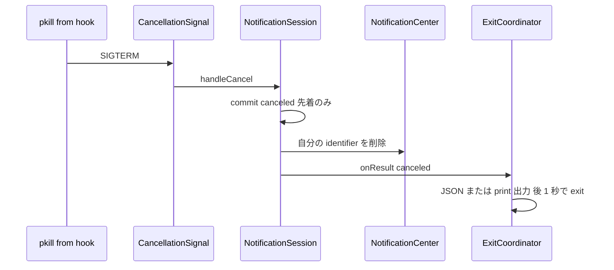

# Technical Design Document: notification-lifecycle

## Overview

**Purpose**: 本機能は、yobirin の待機プロセスが「自分が配信した通知」を正しく後始末できるようにする。同一 group の並行実行で他プロセスの通知を誤削除するバグを修正し、SIGTERM による能動的なキャンセル (通知削除 + `canceled` の結果確定) を追加する。

**Users**: coding agent の hook から yobirin を使う開発者。特に「会話再開時に古い通知を `pkill -f <group文字列>` の1行で消す」運用を可能にする。

**Impact**: 通知の内部名 (identifier) の構成規則が変わるが、これは外部契約ではない。外部から観測できる変更は (a) 並行時の誤削除がなくなること、(b) SIGTERM への応答、(c) 結果種別 `canceled` の追加、の3点。既存の結果5種の JSON・終了コード・削除挙動は不変。

### Goals

- 同一 group のプロセスが何個並行しても、削除は常に「自分が配信した1件」に限定される (1)
- SIGTERM を受けた待機プロセスが、通知を削除して `canceled` で正常終了する (2)
- `canceled` が既存の出力契約 (JSON / `--exit-code` / `--print`) に一貫した形で加わる (3)
- README (en/ja) が新しい結果種別とキャンセル運用を説明する (4)

### Non-Goals

- SIGINT ほか他シグナルへの対応 (requirements の確定判断: POSIX 慣習 128+2 を尊重)
- `dismiss` サブコマンドの新設 (待機プロセスが残るため SIGTERM 案に収斂済み)
- `sweep` / `ps` / `doctor` の挙動変更
- dotfiles 側の hook スクリプト変更 (別リポジトリ)

## Boundary Commitments

### This Spec Owns

- 通知 identifier の構成規則 (group ⇔ identifier の変換と一致規則) の単一ソース
- group 置換の走査ロジックと、タイムアウト/キャンセル時の自己削除の対象決定
- SIGTERM 受信からキャンセル確定までの経路
- 結果種別 `canceled` の契約差分 (JSON 表現・終了コード 5・`--print` の値)
- `NotificationCenterClient` の配信済み一覧メソッドの形 (identifier 列への変更)

### Out of Boundary

- `NotificationSession` の応答判別・一度きり確定機構そのもの (利用するが変更しない)
- `ResultEmitter` の出力方針機構 (`OutputPolicy` / `PrintField` の仕組み。case 追加のみ)
- 起動ゲート・サブコマンド構成・インストーラ
- 既存 spec `yobirin-cli` / `cli-arguments-ux` の文書 (契約の差分は本 spec が所有する)

### Allowed Dependencies

- `Dispatch` (`DispatchSource.makeSignalSource`) — シグナル受信。通知系コンポーネントからのみ
- 既存の `NotificationCenterClient` 抽象・`ExitCoordinator` の遅延 exit・`committedLock` の排他
- `Foundation` の Base64 (`Data.base64EncodedString`)

**依存の禁止事項**: インストール系コマンド (`install` / `uninstall` / `list` / `ps` / `completion`) には一切触れない。identifier 規則を `NotificationSession` の外で複製しない。

### Revalidation Triggers

- `NotificationResult` への case 追加 — `Output.swift` の `switch` 網羅 (`jsonString` / `value(for:)` / `exitCode(for:)`) がコンパイル時に強制されるが、README の表は手動追随が必要
- `NotificationCenterClient` のメソッド置換 — モック実装5クラスと `LaunchGuard` が追随必須
- identifier 構成規則の変更 — 旧バージョンが配信した通知を新バージョンの走査が拾えなくなる (後述の移行考慮)
- 短縮オプション同様、`--group` の意味変更は `ps` の argv 表示や dotfiles の `pkill -f` 運用に波及する (本 spec では変更しない)

## Architecture

### Existing Architecture Analysis

本設計が乗る既存の構造:

- **一度きり確定**: `NotificationSession.commit` が `committedLock` で先着1件のみを確定し、`onResult` を一度だけ呼ぶ。タイムアウト時はここで自分の通知を削除してから出力する
- **出力経路**: `onResult` → `ResultEmitter.forResult(_:policy:)` → `EmittedOutput` → `ExitCoordinator.finish` (書き込み + 1秒遅延 exit)。結果種別を増やしてもこの経路は変わらない
- **抽象境界**: 通知センター操作は `NotificationCenterClient` プロトコル経由。テストはモック注入
- **既知の SDK 制約**: `UNNotification` はテストから構築できない (LaunchGuardTests に記録)。本設計はこの制約を DD-2 (identifier 列への変更) で解消する

### Architecture Pattern & Boundary Map

新しいコンポーネントは `CancellationSignal` (シグナル受信の配線) と `NotificationIdentity` (identifier 規則の純粋関数群、`NotificationSession.swift` 同居) の2つ。他は既存コンポーネントへの case / メソッド追加。構造変更がないため図は省略する (design-principles: Skip)。

**Dependency direction**: `NotificationIdentity` (純粋) ← `NotificationSession` ← `AppDelegate` / `CancellationSignal` ← `NotifyCommand`。既存の方向を維持し、新しい依存の向きは増えない。

### Technology Stack

| Layer        | Choice / Version                             | Role in Feature                  | Notes                                                         |
| ------------ | -------------------------------------------- | -------------------------------- | ------------------------------------------------------------- |
| Notification | UserNotifications (macOS 13+)                | 配信済み一覧の走査・削除         | 既存依存。プロトコルの返却型のみ変更                          |
| Runtime      | Dispatch (`DispatchSource.makeSignalSource`) | SIGTERM の受信                   | 新規に使用。`signal(SIGTERM, SIG_IGN)` と併用する標準パターン |
| Encoding     | Foundation Base64                            | group の符号化 (identifier 規則) | 新規に使用                                                    |

## File Structure Plan

### 新規ファイル

```
Sources/yobirin/
└── CancellationSignal.swift   # SIGTERM の受信配線 (ソースの生成はここに集約。保持は呼び出し側)
```

`NotificationIdentity` (identifier 規則) は `NotificationSession.swift` へ同居させる。identifier の生成と一致判定は配信・削除と密結合であり、`structure.md`「密結合な型の同居は許容」に従う。

### 変更ファイル

| ファイル                                         | 変更内容                                                                                                                                | 要件                     |
| ------------------------------------------------ | --------------------------------------------------------------------------------------------------------------------------------------- | ------------------------ |
| `Sources/yobirin/NotificationSession.swift`      | `NotificationIdentity` の追加、`deliver` の置換走査化と確定後ガード、`handleCancel` の追加、削除条件の拡張 (timeout → timeout/canceled) | 1.1〜1.5, 2.1, 2.4, 2.5  |
| `Sources/yobirin/NotificationCenterClient.swift` | `getDeliveredNotifications` を `getDeliveredNotificationIdentifiers` へ置換                                                             | 1.3 (走査), テスト容易性 |
| `Sources/yobirin/LaunchGuard.swift`              | プロトコル変更への追随 (identifier 列で掃除。挙動等価)                                                                                  | — (回帰なしの追随)       |
| `Sources/yobirin/Output.swift`                   | `NotificationResult.canceled` の追加、`jsonString` / `value(for:)` / `exitCode(for:)` / `canceledExitCode = 5`                          | 3.1〜3.7                 |
| `Sources/yobirin/AppDelegate.swift`              | `handleCancel()` の追加 (`session.handleCancel()` への1行転送。session が private のため、シグナル配線から Session へ届ける唯一の経路)  | 2.5                      |
| `Sources/yobirin/NotifyCommand.swift`            | 通知系経路の冒頭で `CancellationSignal` を登録 (認可要求より前)                                                                         | 2.5, 2.6                 |
| `Tests/yobirinTests/*`                           | モック5クラスのプロトコル追随、新規テスト                                                                                               | —                        |
| `README.md` / `README.ja.md`                     | 結果種別・終了コード表・キャンセル運用の追記                                                                                            | 4.1〜4.3                 |

## System Flows

### SIGTERM キャンセル



**Key decisions**: キャンセルはタイムアウトと同型の経路に乗る (research.md DD-3)。確定済みなら `handleCancel` は既存の排他により無視される (Req 2.4)。配信前に確定した場合、後から来る認可コールバックの `deliver` はガードにより配信しない (Req 2.5)。

### identifier 規則と group 置換

```
identifier の構成 (NotificationIdentity):
  group あり: base64(utf8(group)) + "#" + UUID
  group なし: UUID

group 置換 (deliver 内):
  1. getDeliveredNotificationIdentifiers で自バンドルの配信済み一覧を取得
  2. base64(group) + "#" を接頭辞に持つ identifier を抽出
  3. 抽出分を removeDeliveredNotifications で削除
  4. 新しい identifier で add
```

Base64 のアルファベットは `#` を含まないため、任意の group 文字列 (先頭部分が一致する group や `#` を含む group) に対して一致が正確になる (Req 1.4、research.md DD-1)。group なしの identifier (UUID) は `#` を含まず、いかなる走査接頭辞とも一致しない (Req 1.5)。

## Requirements Traceability

| Requirement | Summary                       | Components                                               | Interfaces                                       | Flows              |
| ----------- | ----------------------------- | -------------------------------------------------------- | ------------------------------------------------ | ------------------ |
| 1.1, 1.2    | 自分の通知のみ削除            | NotificationIdentity, NotificationSession                | `identifier(group:)`, `commit`                   | identifier 規則    |
| 1.3         | group 置換の維持              | NotificationSession, NotificationCenterClient            | `deliver`, `getDeliveredNotificationIdentifiers` | identifier 規則    |
| 1.4         | 接頭辞衝突の防止              | NotificationIdentity                                     | `replacementPrefix(group:)`                      | identifier 規則    |
| 1.5         | group なしの不干渉            | NotificationIdentity, NotificationSession                | `identifier(group: nil)`                         | identifier 規則    |
| 1.6         | 出力契約の不変                | Output (変更なしの確認)                                  | —                                                | —                  |
| 2.1, 2.3    | キャンセル時の削除と順序      | NotificationSession                                      | `handleCancel`, `commit`                         | SIGTERM キャンセル |
| 2.2         | canceled の確定と出力経路     | NotificationSession, ResultEmitter                       | `commit(.canceled)`                              | SIGTERM キャンセル |
| 2.4         | 先着優先                      | NotificationSession (既存排他)                           | `committedLock`                                  | SIGTERM キャンセル |
| 2.5         | 配信前キャンセル              | NotificationSession                                      | `deliver` の確定後ガード                         | SIGTERM キャンセル |
| 2.6, 2.7    | 非受信時の不変・SIGINT 非対応 | CancellationSignal                                       | SIGTERM のみ登録                                 | —                  |
| 3.1〜3.7    | canceled の出力契約           | Output (NotificationResult / ResultEmitter / PrintField) | `jsonString`, `exitCode(for:)`, `value(for:)`    | —                  |
| 4.1〜4.3    | README                        | ドキュメント                                             | —                                                | —                  |

## Components and Interfaces

| Component                       | Domain/Layer | Intent                                             | Req Coverage  | Key Dependencies (P0/P1)      | Contracts |
| ------------------------------- | ------------ | -------------------------------------------------- | ------------- | ----------------------------- | --------- |
| NotificationIdentity            | Notification | identifier の生成・一致規則の単一ソース (純粋関数) | 1.1〜1.5      | Foundation (P0)               | Service   |
| NotificationSession (変更)      | Notification | 置換走査・確定後ガード・キャンセル確定             | 1, 2          | NotificationCenterClient (P0) | State     |
| CancellationSignal              | Notification | SIGTERM の受信と配線                               | 2.5, 2.6, 2.7 | Dispatch (P0)                 | Service   |
| NotificationCenterClient (変更) | Notification | 配信済み一覧を identifier 列で返す                 | 1.3           | UserNotifications (P0)        | Service   |
| Output (変更)                   | Output       | `canceled` の JSON・終了コード・print 値           | 3             | —                             | API       |

### NotificationIdentity

| Field        | Detail                                       |
| ------------ | -------------------------------------------- |
| Intent       | 通知 identifier の生成と一致規則の単一ソース |
| Requirements | 1.1, 1.2, 1.4, 1.5                           |

**Contracts**: Service [x]

##### Service Interface

```swift
/// NotificationSession.swift に同居する純粋関数群。identifier 規則をここ以外で組み立てない。
enum NotificationIdentity {
    /// group あり: base64(utf8(group)) + "#" + UUID / group なし: UUID
    static func makeIdentifier(group: String?) -> String

    /// group 置換の走査接頭辞: base64(utf8(group)) + "#"
    static func replacementPrefix(group: String) -> String
}
```

- Invariants: `makeIdentifier(group: g)` は常に `replacementPrefix(group: g)` を接頭辞に持つ / 異なる group の `replacementPrefix` 同士は接頭辞関係にならない / group なしの identifier はいかなる `replacementPrefix` にも一致しない

**Implementation Notes**

- Risks (移行): 旧バージョン (identifier = 生の group) が配信した通知は、新バージョンの走査接頭辞に一致せず置換されない。1回だけ残留し得るが、タイムアウト削除・`sweep`・クリックで解消する一過性の影響。設計として許容し README には書かない (バージョン混在は `yobirin install` 更新までの過渡状態)

### NotificationSession (変更)

| Field        | Detail                                             |
| ------------ | -------------------------------------------------- |
| Intent       | 置換走査・確定後の配信ガード・キャンセル確定の追加 |
| Requirements | 1.1, 1.2, 1.3, 1.5, 2.1, 2.3, 2.4, 2.5             |

**Responsibilities & Constraints**

- `deliver`: `NotificationIdentity.makeIdentifier` で自分の identifier を採番し、group 指定時は一覧取得 → 接頭辞抽出 → 削除 → add の順で置換する (1.3)。**結果確定済みの場合は何も配信しない** (2.5 のガード)
- `handleCancel()`: `commit(.canceled)`。`handleTimeout` と対になる入力
- `commit`: 自分の通知の削除条件を「`.timeout`」から「`.timeout` または `.canceled`」へ拡張。削除対象は自分が採番したユニークな identifier のみ (1.1, 1.2, 2.1)
- 一度きり確定の機構 (`committedLock`) は変更しない。キャンセルと応答の競合は先着が勝つ (2.4)

**Implementation Notes**

- Integration: 置換走査の非同期化により `deliver` 内部が completionHandler 連鎖になるが、`deliver` の外部契約 (throws + 任意の completionHandler) は変えない
- Risks: 2プロセス同時置換の TOCTOU (research.md D3)。現行にも同種の窓があり悪化ではない。既知の限界として記録

### CancellationSignal

| Field        | Detail                                                                       |
| ------------ | ---------------------------------------------------------------------------- |
| Intent       | SIGTERM を受けてキャンセル入力へ変換する配線 (DispatchSource の唯一の保持者) |
| Requirements | 2.5, 2.6, 2.7                                                                |

**Contracts**: Service [x]

##### Service Interface

```swift
/// SIGTERM の既定動作を無効化し、main queue で onCancel を呼ぶソースを保持する。
/// 戻り値を保持しない限りソースは生きない (呼び出し側が保持する)。
enum CancellationSignal {
    static func install(onCancel: @escaping () -> Void) -> DispatchSourceSignal
}
```

- Preconditions: `NotifyCommand.run()` の通知系経路の冒頭 (認可要求より前) で呼ぶ — 配信前の受信 (2.5) を取りこぼさないため
- Postconditions: 戻り値のソースは呼び出し側 (`NotifyCommand.run()`) がローカルに保持する。`NSApplication.run()` は返らないため、そのスタックフレーム上の保持でプロセス生存中の受信が保証される
- Invariants: 登録するのは SIGTERM のみ (2.7)。SIGINT には触れない

**Implementation Notes**

- Integration: `signal(SIGTERM, SIG_IGN)` で既定動作を無効化してから `DispatchSource.makeSignalSource(signal: SIGTERM, queue: .main)`。ハンドラ内は任意コードが安全 (async-signal-safety の制約は DispatchSource が吸収)
- Validation: SIGTERM は実プロセステストで検証可能 (`Process` 起動 → `terminate()` → 出力と終了コードの確認)。GUI 不要
- Risks: ハンドラ登録後は遅延 exit 中 (最大1秒) に TERM で死ななくなるが、確定済み結果の維持は 2.4 の意図どおり。SIGKILL の挙動 (孤児化) は従来と同じで仕様外

### NotificationCenterClient (変更)

| Field        | Detail                                            |
| ------------ | ------------------------------------------------- |
| Intent       | 配信済み一覧を identifier 列で返す形へ置換        |
| Requirements | 1.3 (走査の実現), テスト容易性 (research.md DD-2) |

##### Service Interface

```swift
protocol NotificationCenterClient {
    // getDeliveredNotifications(completionHandler:) を置換:
    func getDeliveredNotificationIdentifiers(completionHandler: @escaping @Sendable ([String]) -> Void)
    // 他のメソッドは不変
}
```

**Implementation Notes**

- Integration: 実アダプタが `UNNotification → request.identifier` の写像を担う。`LaunchGuard` は identifier しか使っていないため、置換への追随は挙動等価
- Validation: モックが任意の identifier 列を返せるようになり、置換走査と掃除の非空フィクスチャ検証が初めて可能になる (LaunchGuardTests の既存 CONCERNS が解消)

### Output (変更)

| Field        | Detail                         |
| ------------ | ------------------------------ |
| Intent       | 結果種別 `canceled` の契約追加 |
| Requirements | 3.1〜3.7                       |

##### API Contract

| 項目                                      | 値                                                                           |
| ----------------------------------------- | ---------------------------------------------------------------------------- |
| JSON                                      | `{"result":"canceled"}` (種別固有フィールドなし。キー順規約は既存どおり)     |
| `--exit-code` 指定時                      | 5 (`ResultEmitter.canceledExitCode`。1/2 予約・3/4/10+ 使用済みと衝突しない) |
| `--exit-code` 未指定時                    | 0 (既存の `forResult` の policy 分岐が自動的に満たす)                        |
| `--print result`                          | `canceled`                                                                   |
| `--print action` / `actionIndex` / `text` | 値なし → 出力なし + 結果に対応する終了コード (既存規則)                      |

**Implementation Notes**

- Integration: `NotificationResult` への case 追加により、`jsonString` / `value(for:)` / `exitCode(for:)` の switch 網羅が**コンパイル時に強制**される。追随漏れは起きない
- Validation: 既存5種の出力・終了コードが不変であることを回帰テストで固定する (3.6)

## Error Handling

新しいエラー分類は増えない。キャンセルは「ユーザー応答」と同格の正常な結果であり、既存の3分類 (結果 / 未許可 / 環境エラー) の「結果」に加わる。SIGTERM 受信時に通知が未配信なら削除はスキップされ (`deliveredIdentifier == nil`)、結果確定のみ行われる。

## Testing Strategy

### Unit Tests

1. `NotificationIdentity` — 同一 group の identifier が接頭辞規則を満たす、`a` と `ab` / `a` と `a#b` の接頭辞が互いに一致しない (1.4)、group なしがどの接頭辞にも一致しない (1.5)、`#` や非 ASCII を含む group の往復
2. `NotificationSession.deliver` の置換走査 — モックが返す identifier 列 (自 group 2件 + 他 group 1件 + group なし 1件) から自 group のみ削除される (1.3, 1.4, 1.5)
3. `NotificationSession` の並行削除 — セッション A の timeout が、モック上のセッション B の identifier を削除しないこと (1.1, 1.2)
4. `handleCancel` — canceled で確定し自分の通知を削除する (2.1)、確定済み後の cancel が無視される (2.4)、cancel 確定後の `deliver` が配信しない (2.5)、未配信時の cancel が削除なしで確定する
5. `Output` — `{"result":"canceled"}` の JSON (3.1)、`exitCode(for: .canceled) == 5` と予約コード非衝突 (3.2, 3.7)、`value(for:)` の canceled 行 (3.4, 3.5)、既存5種の回帰 (3.6, 1.6)

### Integration Tests

1. モック連鎖 (Session → Emitter → ExitCoordinator) で、cancel 確定 → 削除 → 出力 → 遅延 exit の順序 (2.2, 2.3)
2. `LaunchGuard` のプロトコル追随 — 非空 identifier 列での掃除 (既存 CONCERNS の解消を含む)

### Process Launch Tests (実バイナリ)

1. 応答待ちの実プロセスへ `Process.terminate()` (SIGTERM) → stdout に `{"result":"canceled"}`、`--exit-code` 付きなら exit 5 (2.1, 2.2, 3.1, 3.2)。通知許可が不要な経路にならない場合は `YOBIRIN_HOME` 密閉下の設計を検討し、不可能なら手動検証へ回す

### Manual Verification (GUI 依存)

1. 通知表示中に `pkill -f <group>` → 通知センターから通知が消え、`canceled` が出力される (2.1, 2.3)
2. 同一 group の通知を5分以内に2回出し、1回目のタイムアウト時刻を過ぎても2回目の通知が残っている (1.1, 1.2 — 修正前は消えていた)

## Open Questions / Risks

| 項目                          | 内容                                                                                             | 扱い                                                                                                             |
| ----------------------------- | ------------------------------------------------------------------------------------------------ | ---------------------------------------------------------------------------------------------------------------- |
| 実プロセスでの SIGTERM テスト | 通知配信はバンドル必須のため、実バイナリテストは「認可前に SIGTERM」の経路に限られる可能性がある | タスクフェーズで実挙動を確認し、届かない範囲は手動検証へ明示的に回す                                             |
| バージョン混在の残留通知      | 旧 identifier 形式の通知は新バージョンの置換で拾えない                                           | 一過性 (タイムアウト・sweep・クリックで解消) として許容。NotificationIdentity の Implementation Notes に記録済み |
