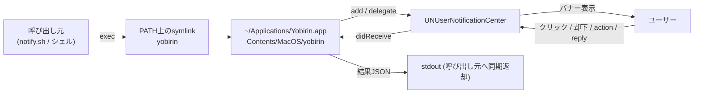
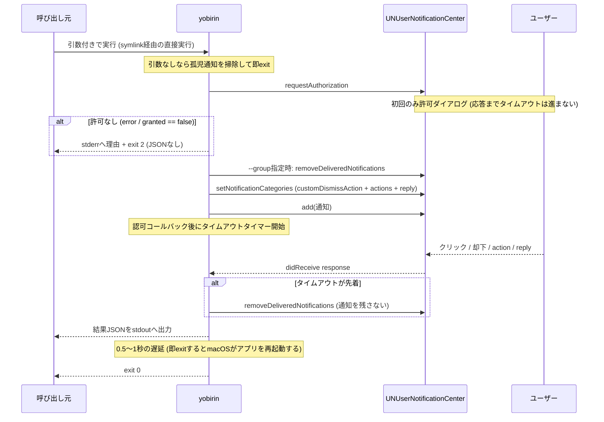
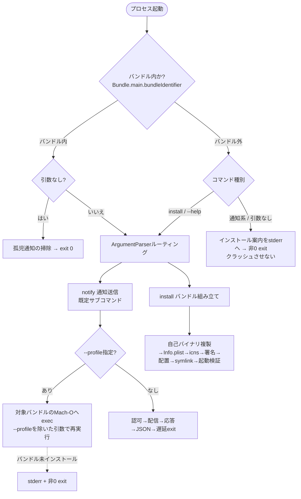

# Design Document

> 本designは `docs/design-research.md` (2026-07-26) からの移植である。すべての決定は同日の実機検証 (macOS 26 / Darwin 25) に基づく。調査・検証の記録は `research.md` と原本を参照。

## Overview

**Purpose**: yobirin は、通知を1件配信し、ユーザーの反応 (クリック / 却下 / アクション / reply / タイムアウト) を同期的に捕捉して結果JSONをstdoutへ出力するmacOS向けワンショット型通知CLIである。メモリリークを抱えるalerterの代替として、ポーリングを使わないモダンAPI (`UNUserNotificationCenter`) で同等機能を提供する。

**Users**: シェルスクリプトやcoding agent (Claude Code / Codex等) の通知hookから通知への反応を扱いたい開発者が、alerterの置き換えとして利用する。

**Impact**: 新規プロダクト。dotfilesの通知ルーター (notify.sh) のバックエンドであるalerter呼び出し1箇所を将来差し替えるが、本specではdotfiles側に手を入れない。yobirin自体はdotfilesの事情を知らない汎用CLIとして設計する。

### Goals

- alerterと同等の機能: 通知送信、クリック / 却下 / タイムアウトの捕捉、アクションボタン、reply入力、サウンド、グループ置き換え。結果は同期的に待って構造化データ (JSON) をstdoutへ出力して終了する
- ポーリングを使わず、`UNUserNotificationCenter` のdelegateコールバックで却下まで検知する (リークの構造的排除)
- `--timeout` によるプロセス生存時間の有界化
- dotfilesのhookから移行できること (hook側スクリプトの書き換えは許容)

### Non-Goals

- alerterとのCLI・出力互換 (オプション名・JSONスキーマはゼロから設計)
- 私用APIに依存する機能の再現 (`-sender` によるアプリ偽装、`--app-icon` によるアイコン動的差し替え)
- 他アプリへのなりすまし (alerterは `com.apple.Terminal` へのなりすましでアイコン差し替えを成立させていた)
- Linux / Windows対応、通知センターに常駐するデーモン化
- Homebrew formula化・Developer ID署名・公証 (OSS化フェーズM4で扱う)

## Boundary Commitments

### This Spec Owns

- yobirin CLI本体: 引数パース、通知配信、応答捕捉、結果JSON出力、終了コード
- CLIオプション体系 (サブコマンド構造を含む) と出力JSONスキーマ (呼び出し側との契約)
- `.app` バンドルの構成と、CLI自身によるバンドル組み立て・インストール (`install` サブコマンド)
- インストール構成: `~/Applications` への配置、PATH上のsymlink (1本)、アイコンプロファイル (派生バンドル) と `--profile` ディスパッチ
- 実行ファイルのビルドパイプライン (CI) とリリース配布 (ユニバーサルバイナリの添付)

### Out of Boundary

- notify.sh / hookスクリプトの書き換え (dotfiles側の作業)
- alerter互換レイヤ
- Linux / Windows対応、デーモン化
- Homebrew formula・notarization (M4 OSS化フェーズ)

### Allowed Dependencies

- システムフレームワーク: UserNotifications、AppKit、ImageIO / UniformTypeIdentifiers (icns生成)
- swift-argument-parser (引数パース)
- 実行時の外部コマンド: `codesign` (インストール時のad-hoc署名。Xcode CLT前提)
- ビルド時 (CI): Xcode Command Line Tools (`swiftc`, `lipo`)
- 制限付きentitlementを要求する機能は使用禁止 (ad-hoc署名では起動不能になる)

### Revalidation Triggers

- 出力JSONスキーマ・終了コード体系の変更 (notify.sh等の呼び出し側が依存)
- CLIオプション・サブコマンド体系の互換性を壊す変更 (`yobirin --title ...` の直接呼び出しと `--profile` の意味)
- Bundle ID・インストール配置 (バンドルの場所、symlinkの向き先) の変更
- インストール手段の変更 (シェルスクリプト廃止→CLI一元化により、dotfilesのインストール手順は追従書き換えが必要)

## Architecture

### Architecture Pattern & Boundary Map



- **Selected pattern**: 単一プロセスのワンショット型CLI。ラッパープロセス・IPC・`open` (LaunchServices) 経由の起動はいずれも不要 (実測で確定。symlinkからの直接実行で通知が出せ、結果はそのプロセスのstdoutに返る)
- **並行実行**: 同一バンドルの複数インスタンスを並行実行しても、コールバックは配信元インスタンスにのみ届く (実測確認済み)。衝突対策は不要
- **Steering compliance**: `tech.md` の「絶対に守る制約」8項目にすべて準拠する

#### CLIとアプリの二面性 (設計原則)

yobirinがアプリ (`.app`) である理由は `UNUserNotificationCenter` がバンドルを要求するという一点であり、**アプリの側面を必要とするのは通知に関わる機能だけ**である。この境界を設計原則として固定する:

- コマンドは**通知系** (バンドル必須。既定の通知送信、引数なし時の孤児掃除) と**インストール系** (バンドル不要。`install` サブコマンド) の2群に分類する
- インストール系は通知APIの型に一切触れない。素のMach-O (リリースから落とした直後のバイナリ) で完走する (Requirement 12.1。実測: ArgumentParserはマッチした葉コマンドの `run()` だけを呼ぶため構造的に保証できる)
- 起動フローの最初に**バンドル外検知** (`Bundle.main.bundleIdentifier == nil`) を置き、バンドル外での通知系要求は案内メッセージ + 非0終了に振り替える (Requirement 12.2/12.3。現状は `UNNotificationCenterAdapter` の非lazyな格納プロパティによりSIGABRTする — 実測)
- 配布物と実体は単一バイナリのまま (自己複製でバンドルを組み立てるため、分割すると「1つ落とせば済む」が成立しない)

#### .appバンドル必須問題

`UNUserNotificationCenter` はbundle identifierを持つアプリからしか使えない。素のMach-Oでは `bundleProxyForCurrentProcess is nil` で例外死し、埋め込みInfo.plistでも回避できない (実測)。そのため実体は `.app` バンドル内のMach-Oとする:

```text
Yobirin.app/
  Contents/
    Info.plist          # CFBundleIdentifier=com.mjun0812.yobirin, LSUIElement=true (Dockに出さない)
    MacOS/yobirin       # Swift製CLI実体
    Resources/AppIcon.icns  # ビルド時に焼き込み
```

- PATHには `Contents/MacOS/yobirin` へのsymlinkを置き、直接実行する
- バンドルは `~/Applications` 等の正規の場所に置く。初回の通知許可ダイアログはこの条件でのみ表示される (`/private/tmp` 等では `lsregister` しても `open` 経由でもダイアログが出ない)。許可取得後は場所を問わず動作する
- アプリのライフサイクルは `NSApplication.run()` + AppDelegate方式とする。`RunLoop.main.run()` だけでは `applicationDidFinishLaunching` が来ず通知許可が取れない (実測)

### Technology Stack

| Layer         | Choice / Version                               | Role in Feature                  | Notes                                         |
| ------------- | ---------------------------------------------- | -------------------------------- | --------------------------------------------- |
| CLI           | Swift + swift-argument-parser                  | 引数パース                       |                                               |
| 通知          | UserNotifications (`UNUserNotificationCenter`) | 通知配信・応答捕捉               | 非推奨 `NSUserNotification` は使わない        |
| App lifecycle | AppKit (`NSApplication.run()` + AppDelegate)   | 認可・待機・終了制御             | AppDelegate方式が必須 (実測)                  |
| ビルド (CI)   | Swift Package (executableTarget) + `lipo`      | ユニバーサル実行ファイルの生成   | Xcodeプロジェクト・シェルスクリプトは使わない |
| バンドル組立  | CLI自身 (`install` サブコマンド) + ImageIO     | 自己複製・Info.plist・icns・配置 | 実装はこの1箇所のみ (Requirement 9.3)         |
| 署名          | `codesign` ad-hoc (外部コマンド起動)           | インストール時の署名             | 制限付きentitlement付与は禁止                 |

## File Structure Plan

### Directory Structure

```text
Package.swift                    # executableTarget + swift-argument-parser依存
Sources/yobirin/
├── Yobirin.swift                # ルートコマンド (subcommands + defaultSubcommand)、起動ゲート (バンドル外検知→引数なしガード→ルーティング)
├── NotifyCommand.swift          # 通知送信サブコマンド (既定)。既存オプション群 + --profile
├── ProfileDispatch.swift        # --profile指定時に対象バンドルのMach-Oへexecする薄いディスパッチ
├── InstallCommand.swift         # installサブコマンドの引数定義 (--profile / --icon)
├── Installer.swift              # バンドル組み立て・配置・symlink・署名・起動検証のオーケストレーション
├── IcnsWriter.swift             # ImageIOによるicns生成 (10スロット、DPIメタデータ付与)
├── DefaultIcon.swift            # 同梱標準アイコンのバイト列 (生成済みソース。再生成手順をコメントで保持)
├── AppDelegate.swift            # NSApplicationライフサイクル、認可フロー、遅延exit
├── NotificationSession.swift    # category登録・group置換・通知add・delegate応答処理・結果の排他確定
├── NotificationCenterClient.swift # UN抽象化 (centerプロパティは遅延評価へ修正 — バンドル外で型に触れても死なない)
└── Output.swift                 # 結果JSON生成・stdout出力・終了コード
assets/
└── icon/                        # アイコン元画像 (リポジトリ用。実行時は参照しない)
.github/workflows/
├── ci.yml                       # build / test / lint (既存のまま)
└── release.yml                  # v*タグ → テスト → ユニバーサルバイナリ生成 → Release作成 (既存のまま)
```

### Deleted Files

- `scripts/build-app.sh` — バンドル組み立てはInstallerへ一元化 (Requirement 9.3)
- `scripts/install.sh` — `yobirin install` へ置換

> ファイル分割は責務の単位を示す。実装時に統合・分割してよいが、責務の境界 (CLI / ディスパッチ / インストール / ライフサイクル / 通知セッション / 出力) は保つこと。既存の AppFlow.swift / Scheduler.swift / LaunchGuard.swift / ExitCoordinator.swift / NotificationRequest.swift は変更対象外 (Yobirin.swiftの起動ゲート再構成で呼び出し位置のみ変わる)。

## System Flows



### 起動ゲートとインストールのフロー



インストールの処理順 (Requirement 11):

1. 一時ディレクトリに `Contents/{MacOS,Resources}` を組み立てる。実行ファイルは**実行中の自分自身** (`_NSGetExecutablePath` で解決) をコピー
2. `Info.plist` を生成 (Bundle ID / 名前はプロファイル規約から導出、`LSUIElement=true`)
3. アイコン (`--icon` のPNG、未指定なら同梱の標準アイコン) をicnsへ変換して焼き込む
4. `codesign --force --sign -` でad-hoc署名 (entitlementなし)。失敗は非0で終了
5. `~/Applications` の旧バンドルを削除してから配置 (固定パス検証つき)、symlinkを張り替え (非symlinkの実ファイルがあれば非破壊で中断)
6. 起動検証: `codesign --verify --deep --strict` + 配置済みバイナリの `--help` 実行。失敗は非0で終了

フローに関する決定:

- `--profile` ディスパッチは通知系のみ対象。`install --profile <name>` は「そのプロファイルのバンドルを作る」意味であり、execしない
- execはPOSIX `execv` でプロセスを置き換える (stdout/stderr/終了コードが呼び出し元へ透過し、結果JSONの同期返却がそのまま成立する)。ディスパッチ先ではバンドル内実行になるため `--profile` は付けずに渡し、再ディスパッチは構造的に起きない
- 結果確定は「クリック / 却下 / タイムアウト」の早い者勝ち。`OSAllocatedUnfairLock` かactorで一度きりの `emit` を保証する (alerter #65がNSLockで後付けした部分を最初から設計に入れる)
- 応答を受け付けるのはプロセス生存中のみ (alerter準拠)。timeout時は通知を削除してから出力・終了するため、「exit後の通知クリックで.appが再起動される」問題は構造的に発生しない
- SIGKILL等の異常終了時は通知が残り、クリックで.appが引数なし起動される。引数なしガード + 孤児通知の掃除でこのエッジを塞ぐ

## Requirements Traceability

| Requirement | Summary                      | Components                                         | Interfaces             | Flows                     |
| ----------- | ---------------------------- | -------------------------------------------------- | ---------------------- | ------------------------- |
| 1           | 通知の送信                   | YobirinCommand, NotificationSession                | CLI契約                | メインフロー              |
| 2           | グループによる置き換え       | NotificationSession                                | CLI契約 (`--group`)    | メインフロー              |
| 3           | 応答の捕捉と結果JSON出力     | NotificationSession, ResultEmitter                 | 出力JSON契約           | メインフロー              |
| 4           | アクションボタンとreply入力  | YobirinCommand, NotificationSession                | CLI契約 / 出力JSON契約 | メインフロー              |
| 5           | タイムアウトとライフサイクル | AppLifecycle, NotificationSession                  | CLI契約 (`--timeout`)  | タイムアウト分岐          |
| 6           | 再起動への防御               | AppLifecycle                                       | -                      | 遅延exit / 引数なしガード |
| 7           | 通知許可とエラー処理         | AppLifecycle, ResultEmitter                        | 終了コード契約         | 許可なし分岐              |
| 8           | .appバンドルと配布構成       | Installer, Install layout                          | -                      | インストールフロー        |
| 9           | ビルドパイプライン           | Release CI, Installer                              | -                      | -                         |
| 10          | アイコンプロファイル         | ProfileDispatch, Installer                         | CLI契約 (`--profile`)  | 起動ゲートフロー          |
| 11          | CLIによるインストール        | InstallCommand, Installer, IcnsWriter, DefaultIcon | CLI契約 (install)      | インストールフロー        |
| 12          | バンドル外実行時の安全性     | Yobirin (起動ゲート), NotificationCenterClient     | -                      | 起動ゲートフロー          |
| 13          | ビルド済みバイナリの配布     | Release CI                                         | -                      | -                         |

## Components and Interfaces

| Component           | Domain/Layer | Intent                                                       | Req Coverage | Key Dependencies           | Contracts  |
| ------------------- | ------------ | ------------------------------------------------------------ | ------------ | -------------------------- | ---------- |
| YobirinCommand      | CLI          | ルートコマンド (サブコマンド構造)、起動ゲート                | 11, 12       | swift-argument-parser (P0) | CLI        |
| NotifyCommand       | CLI          | 通知送信の既定サブコマンド。オプション定義・入力検証         | 1, 2, 4, 5   | swift-argument-parser (P0) | CLI        |
| ProfileDispatch     | CLI          | `--profile` 指定時に対象バンドルのMach-Oへexec               | 10           | Darwin execv (P0)          | CLI        |
| InstallCommand      | Install      | installサブコマンドの引数定義                                | 11           | swift-argument-parser (P0) | CLI        |
| Installer           | Install      | 自己複製→Info.plist→icns→署名→配置→symlink→起動検証          | 8, 9, 11     | 外部codesign (P0)          | Batch      |
| IcnsWriter          | Install      | ImageIOによるicns生成 (10スロット)                           | 11           | ImageIO (P0)               | -          |
| DefaultIcon         | Install      | 同梱標準アイコンのバイト列 (生成済みソース)                  | 11           | -                          | -          |
| AppLifecycle        | App          | NSApplication起動、認可フロー、引数なしガード、遅延exit      | 5, 6, 7      | AppKit (P0)                | -          |
| NotificationSession | Notification | category登録・group置換・通知add・応答処理・結果の排他確定   | 2, 3, 4, 5   | UserNotifications (P0)     | State      |
| ResultEmitter       | Output       | 結果JSON生成・stdout出力・終了コード                         | 3, 7         | Foundation (P0)            | API (JSON) |
| Release CI          | Build        | v*タグ→テスト→ユニバーサル実行ファイル→Release作成           | 9, 13        | GitHub Actions (P0)        | Batch      |
| Install layout      | Distribution | `~/Applications` 配置・symlink 1本・プロファイル派生バンドル | 8, 10        | -                          | -          |

### CLI

#### YobirinCommand (ルート) / NotifyCommand / ProfileDispatch

| Field        | Detail                                                                               |
| ------------ | ------------------------------------------------------------------------------------ |
| Intent       | サブコマンド構造のルート、起動ゲート、通知オプションの定義、プロファイルディスパッチ |
| Requirements | 1, 2, 4, 5, 10, 11.8, 12                                                             |

**Responsibilities & Constraints**

- ルートは `CommandConfiguration(subcommands: [NotifyCommand, InstallCommand], defaultSubcommand: NotifyCommand)`。既存の `yobirin --title ...` はNotifyCommandへ解決され互換を保つ (Requirement 11.8)
- 起動ゲート (エントリポイント) の判定順: バンドル外検知 → (バンドル内なら) 引数なしガード → ArgumentParserルーティング。バンドル外では通知系と引数なしをインストール案内 + 非0終了へ振り替える (Requirement 12)
- `NotificationCenterClient` の `center` は遅延評価へ修正し、型への参照だけでクラッシュする地雷を除去する (実測: 非lazy格納プロパティがSIGABRTの真因)
- ProfileDispatch: NotifyCommandが `--profile` を受けたとき、`ProfileNaming` で導出したバンドル内Mach-Oへ `execv` する。引数は `--profile` を除いて透過し、再ディスパッチは構造的に起きない。対象未インストールは環境エラー (Requirement 10.5)

##### CLI契約

ルートコマンドは `notify` を既定サブコマンドとするサブコマンド構造。既存の `yobirin --title ...` 形式は `defaultSubcommand` によりそのまま `notify` へ解決される (Requirement 11.8)。

```text
# 通知送信 (既定サブコマンド。サブコマンド名の明示は不要)
yobirin --title <str> --message <str>
        [--profile <name>]       # 対象プロファイルのバンドルへディスパッチして配信
        [--subtitle <str>]
        [--group <id>]           # 同一groupの既存通知を置き換え
        [--timeout <sec>]        # 省略時は無期限 (hookからは必ず指定する運用)
        [--action <label>]...    # 複数指定可。2つ以上はOSがドロップダウン表示
        [--reply]                # テキスト入力アクションを有効化
        [--reply-placeholder <str>]  # replyの入力欄placeholder (--replyと併用必須)
        [--sound default|<name>]
        [--image <path>]         # UNNotificationAttachment (サムネイル)

# インストール (バンドル不要。素のバイナリから実行できる)
yobirin install
        [--profile <name>]       # 指定時は派生バンドル (Yobirin-<Name>.app) を導入。省略時はデフォルト
        [--icon <path>]          # 焼き込むアイコンPNG。省略時は同梱の標準アイコン (鈴)
```

- Preconditions: `--title` と `--message` は必須。バンドル内での引数なし起動は通知を出さず即exit (孤児掃除)、バンドル外ではインストール案内 (起動ゲート)
- プロファイル名は `^[a-z0-9]+$` に制限 (パス注入防止。既存規約の踏襲)
- 通知の実行時アイコン指定 (`--icon` を通知送信に付ける形) は提供しない (実現手段が存在しない)。`install --icon` は焼き込み時の指定であり別物

### App

#### AppLifecycle

| Field        | Detail                                                        |
| ------------ | ------------------------------------------------------------- |
| Intent       | `NSApplication.run()` + AppDelegateによる起動・認可・終了制御 |
| Requirements | 5, 6, 7                                                       |

**Responsibilities & Constraints**

- `applicationDidFinishLaunching` で `requestAuthorization` → 認可コールバック後に通知配信とタイムアウトタイマー開始 (許可ダイアログ表示中はタイムアウトが進まない。`--timeout 5` で48秒待った実測に基づく)
- 通知許可の拒否は `granted == false` ではなく `UNErrorDomain Code=1` のエラーとして返る (未許可状態と同じエラーで区別不能)。**error分岐と `granted == false` 分岐の両方で exit 2** とする
- 結果出力後、0.5〜1秒の遅延を置いて `exit 0` (即exitするとmacOSがアプリを再起動し、デフォルト値のまま通知を1件出してしまう。実測)
- 引数なし起動時は、応答待ちの主がいない配信済み通知を掃除して即exit (孤児通知クリックによる再起動への防御)

### Notification

#### NotificationSession

| Field        | Detail                             |
| ------------ | ---------------------------------- |
| Intent       | 通知の配信と応答捕捉。本ツールの核 |
| Requirements | 2, 3, 4, 5                         |

**Responsibilities & Constraints**

- `--group` 指定時: 同一identifierの配信済み通知を `removeDeliveredNotifications` で除去してから `add`
- `customDismissAction` 付き `UNNotificationCategory` を呼び出しごとに `setNotificationCategories` で動的登録 (呼び直しで機能することを実測確認済み)
- actionのidentifierは `yobirin-action-<index>` 形式。replyは `UNTextInputNotificationAction`
- 却下検知はポーリングを使わない。alerter #65のようなautoreleaseプール問題は構造的に発生しない

```swift
let category = UNNotificationCategory(
    identifier: "default",
    actions: actions,  // UNNotificationAction / UNTextInputNotificationAction
    intentIdentifiers: [],
    options: [.customDismissAction]  // 却下時もdidReceiveが呼ばれる
)

func userNotificationCenter(_ center: UNUserNotificationCenter,
                            didReceive response: UNNotificationResponse,
                            withCompletionHandler completionHandler: @escaping () -> Void) {
    switch response.actionIdentifier {
    case UNNotificationDefaultActionIdentifier: emit(.clicked)
    case UNNotificationDismissActionIdentifier: emit(.dismissed)
    default: break  // yobirin-action-<index> / reply はここで判別
    }
    completionHandler()
}
```

##### State Management

- State model: 結果は未確定 → 確定 (clicked / dismissed / action / replied / timeout) の一方向遷移
- Concurrency strategy: `OSAllocatedUnfairLock` かactorで `emit` の一度きり実行を保証する。確定後の応答・タイマー発火は無視

### Output

#### ResultEmitter

| Field        | Detail                                       |
| ------------ | -------------------------------------------- |
| Intent       | 結果JSONの生成とstdout出力、終了コードの決定 |
| Requirements | 3, 7                                         |

契約の詳細は「Data Models > 出力JSON契約」と「Error Handling > 終了コード」を参照。

### Build / Distribution

#### Installer / IcnsWriter / DefaultIcon

| Field        | Detail                                                          |
| ------------ | --------------------------------------------------------------- |
| Intent       | CLI自身によるバンドル組み立て・配置・検証 (実装はこの1箇所のみ) |
| Requirements | 8, 9, 11                                                        |

**Responsibilities & Constraints**

- 通知APIの型に一切触れない (Requirement 12.1。素のMach-Oで完走する)
- 実行ファイルの実体は `_NSGetExecutablePath` で解決した**実行中の自分自身** (symlink経由の起動でも実体パスへ解決する)
- `Info.plist` はプロファイル規約 (`ProfileNaming`: 名前・Bundle ID・symlink名の導出を単一ソース化) から生成。`CFBundleShortVersionString` はバイナリ埋め込みのバージョン定数を使う
- icns生成はImageIOのみ (実測済み)。**各サイズにDPIメタデータ (1x=72 / 2x=144) を必ず付与する** — 付与しないとRetinaスロットが暗黙に捨てられて5サイズへ劣化する
- 署名は外部 `codesign` を `Process` で起動 (API不在のため。素のMach-Oからの起動可否は実測済み)。entitlementは一切付けない
- 配置は「固定パス検証 → 旧バンドル削除 → コピー → symlink張り替え (非symlink実ファイルは非破壊で中断)」の順。旧 `install.sh` の安全策を踏襲
- 起動検証: `codesign --verify --deep --strict` + 配置済みsymlink経由の `--help` 実行。失敗時は非0で終了 (Requirement 11.9)

##### Batch / Job Contract

- Trigger: `yobirin install [--profile <name>] [--icon <path>]`
- Idempotency: 再実行はアップグレードとして動作 (旧バンドル削除→再配置)。同一Bundle IDの複数登録を作らない

#### Release CI

| Field        | Detail                                   |
| ------------ | ---------------------------------------- |
| Intent       | リリースへのユニバーサル実行ファイル添付 |
| Requirements | 9, 13                                    |

- Trigger: `v*` タグのpush (`.github/workflows/release.yml`、既存のまま)
- `swift test` 合格後に `swift build` ×2アーキ → `lipo -create` → `yobirin-universal` をGitHub Releaseへ添付
- バンドルは作らない (組み立てはInstallerの責務)

#### Install layout

| Field        | Detail                                        |
| ------------ | --------------------------------------------- |
| Intent       | 通知が出せる配置と、symlinkによるコマンド提供 |
| Requirements | 8, 10                                         |

```text
~/Applications/Yobirin.app/          # バンドル本体 (正規の場所への配置が必須)
$PATH/yobirin -> ~/Applications/Yobirin.app/Contents/MacOS/yobirin   # symlink
```

- アップグレード時は旧バージョンのバンドルを確実に削除する (同一Bundle IDが複数登録されると、LaunchServicesが意図しないコピーを再起動する。実測)
- アイコンは初回インストール時からバンドルに含める。同じBundle IDに後からアイコンを追加してもキャッシュされた通知ソースには反映されない (実測)

**アイコンのプロファイル方式** (Requirement 10):

```text
~/Applications/Yobirin.app          (標準アイコン, com.mjun0812.yobirin)
~/Applications/Yobirin-Claude.app   (Claudeアイコン, com.mjun0812.yobirin.claude)
~/Applications/Yobirin-Codex.app    (Codexアイコン,  com.mjun0812.yobirin.codex)
$PATH/yobirin -> ~/Applications/Yobirin.app/Contents/MacOS/yobirin   # symlinkはこの1本だけ
```

- アイコンはバンドルの属性なので、アイコンだけ違うバンドルを複数用意すれば使い分けられる (新Bundle IDでアイコンを焼き込んだバンドルはそのアイコンで通知が出ることを実測確認済み)
- プロファイルの選択機構は**単一コマンドの `--profile <name>` ディスパッチ**に確定 (2026-07-27決定。旧決定「プロファイルごとのsymlink」を改訂 — インストーラ内蔵により「Swift側が配置パスへ結合しない」という旧決定の前提が消滅したため。経緯はresearch.md参照)。プロファイルを増やしてもPATHのコマンドは増えない (Requirement 10.4)
- 対象バンドル未インストール時は環境エラー (stderr + 非0、Requirement 10.5)
- 代償: 初回の通知許可がプロファイルごとに必要。システム設定の通知一覧にプロファイルごとの項目が並ぶ
- 利点: 「Claudeの通知だけオフにする」といった制御がユーザー側でできる

## Data Models

### 出力JSON契約

alerter互換の制約はなく、結果種別と付随データを分離したスキーマをゼロから設計する:

```json
{ "result": "clicked", "deliveredAt": "2026-07-26T12:00:00+09:00" }
{ "result": "action",  "action": "Open", "actionIndex": 0 }
{ "result": "replied", "text": "入力されたテキスト" }
{ "result": "dismissed" }
{ "result": "timeout" }
```

| フィールド    | 型     | 出現条件              | 説明                                                           |
| ------------- | ------ | --------------------- | -------------------------------------------------------------- |
| `result`      | string | 常に                  | `clicked` \| `action` \| `replied` \| `dismissed` \| `timeout` |
| `action`      | string | `result == "action"`  | 押されたアクションのラベル                                     |
| `actionIndex` | number | `result == "action"`  | `yobirin-action-<index>` のindex (同名ラベルの識別用)          |
| `text`        | string | `result == "replied"` | 入力されたテキスト                                             |
| `deliveredAt` | string | 任意                  | 通知の配信時刻 (ISO 8601)                                      |

- 呼び出し側は `jq -r '.result'` で分岐する想定
- このスキーマと終了コード体系はRevalidation Triggerである (notify.sh等が依存する契約)

## Error Handling

### Error Strategy

「ユーザーの応答はJSON + exit 0、環境エラーはJSONなし + 非0」の区別を一貫させる。呼び出し側はexitコードだけでfallback判定ができる。

### 終了コード

| 終了コード | 意味                                                                                        | stdout                   | stderr                                                        |
| ---------- | ------------------------------------------------------------------------------------------- | ------------------------ | ------------------------------------------------------------- |
| 0          | ユーザー応答またはtimeoutで正常確定。installの正常完了                                      | 結果JSON (installはなし) | -                                                             |
| 2          | 通知許可なし (`UNErrorDomain Code=1` エラー / `granted == false` の両経路)                  | なし                     | 理由を出力。呼び出し側がosascript等へfallbackできるようにする |
| その他非0  | 環境エラー (引数不正、プロファイル未インストール、バンドル外での通知要求、インストール失敗) | なし                     | エラー内容 / インストール案内                                 |

インストール系の失敗はすべて環境エラー (非0 + stderr) として扱う: アイコンファイル不在・読込不可、署名失敗 (Requirement 11.6)、配置先の非symlink実ファイル衝突 (非破壊で中断)、起動検証失敗 (Requirement 11.9)。バンドル外での通知要求・引数なし起動はクラッシュさせず案内を出す (Requirement 12.2/12.3。現状のSIGABRT + クラッシュレポート生成を解消する)。

### 再起動・孤児通知への防御

| エッジケース                                                      | 防御                                                             |
| ----------------------------------------------------------------- | ---------------------------------------------------------------- |
| 結果出力後の即exitでmacOSがアプリを再起動し余計な通知を出す       | 0.5〜1秒の遅延exit                                               |
| SIGKILL後の孤児通知クリックで.appが引数なし起動される             | 引数なしガード: 通知を出さず、孤児の配信済み通知を掃除して即exit |
| timeout後に通知が残りexit後にクリックされる                       | timeout確定時に `removeDeliveredNotifications` してから終了      |
| 同一Bundle IDの複数バンドル登録でLaunchServicesが別コピーを再起動 | インストーラ/アップグレードで旧バンドルを確実に削除              |

## Testing Strategy

**通知の表示・対話・権限フローは自動テストできない** (GUI依存)。自動テストで完了と判断してはいけない。GUI依存部分は手動検証チェックリストで確認する (steering `tech.md` 準拠)。

### Unit Tests (自動)

- 引数パース: 必須オプション欠落、`--action` 複数指定、`--reply` のplaceholder有無
- サブコマンド互換: `--title/--message` 直接指定がNotifyCommandへ解決されること (Requirement 11.8)、`install --profile/--icon` のパース
- 結果JSON生成: 5種のresultそれぞれのフィールド構成
- action identifier: `yobirin-action-<index>` の生成とindex逆引き
- 終了コード分岐: 許可なし → 2、引数不正 → 非0
- ProfileNaming: プロファイル名 → バンドル名 / Bundle ID / パスの導出、`^[a-z0-9]+$` 検証
- ProfileDispatch: exec引数の構築 (`--profile` の除去、他引数の透過)、未インストール時のエラー分岐 (execそのものはモック)
- IcnsWriter: 生成したicnsをImageIOで読み戻し、10スロット (1x/2x×5サイズ) が存在すること (Requirement 11.3/11.4 — DPIメタデータ欠落の退行検知)
- Installer: Info.plist内容 (Bundle ID / LSUIElement / バージョン)、配置計画のパス (固定パス検証)、非symlink衝突の中断分岐 (ファイル操作はテンポラリ領域で実施)
- 起動ゲート: バンドル外×通知系 → 案内 + 非0、バンドル外×install → 続行、の分岐 (バンドル判定は注入で差し替え)

### Integration Tests (半自動)

- group置換: 同一identifierでの `add` + `removeDeliveredNotifications` の呼び出し順
- timeout確定時に通知削除 → JSON出力 → 遅延 → exit の順で処理されること
- 結果確定の排他: 応答とタイマーの競合で出力が一度きりであること

### 手動検証チェックリスト (GUI必須)

- 通知の表示とバンドルアイコンの反映
- クリック / 却下 / アクション / reply それぞれの検知とJSON内容
- 初回の通知許可ダイアログ表示 (`~/Applications` 配置時) とダイアログ中のタイムアウト停止
- 許可拒否時の exit 2 + stderr
- 引数なし起動で通知が出ないこと。即exit再起動による余計な通知が出ないこと
- 複数インスタンス並行実行で、クリックしたインスタンスにのみ応答が届くこと
- リリースバイナリからのフルブートストラップ: 素の `yobirin-universal` で `install` → symlink経由で通知が出る → `install --profile <name> --icon <path>` → `--profile <name>` で当該アイコン・名義の通知が出る
- バンドル外の素のバイナリで: 引数なし起動と通知送信がクラッシュせず案内 + 非0で終了すること (クラッシュレポートが生成されないこと)

## Supporting References

- `research.md` — 競合分析・実機検証・設計判断の移植記録
- `docs/design-research.md` — 原本 (M2a実機検証の全記録、旧API比較、なりすまし検証を含む)
- [claude-notifications-go `swift-notifier/scripts/build-app.sh`](https://github.com/777genius/claude-notifications-go/blob/main/swift-notifier/scripts/build-app.sh) — バンドル組み立ての主参考
- [vjeantet/alerter PR #65](https://github.com/vjeantet/alerter/pull/65) — alerterのリーク修正PR (排他制御の後付け箇所の参考)
